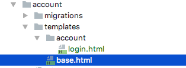
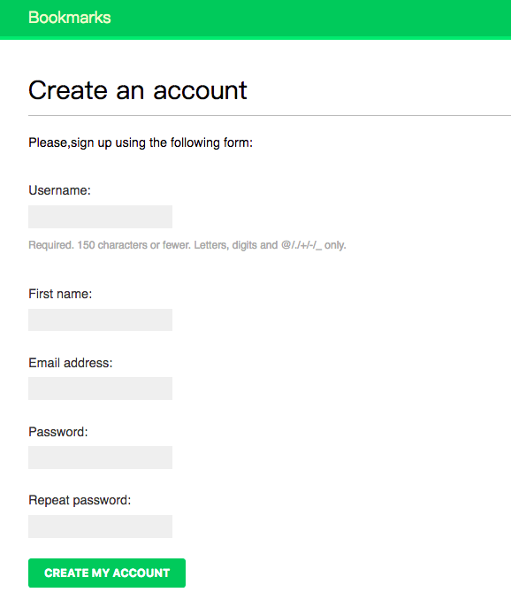
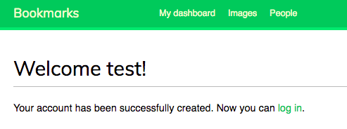
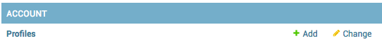
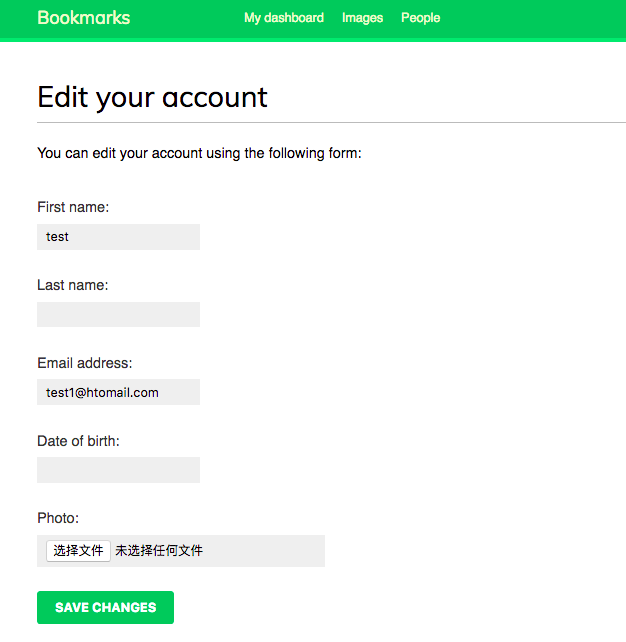
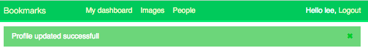
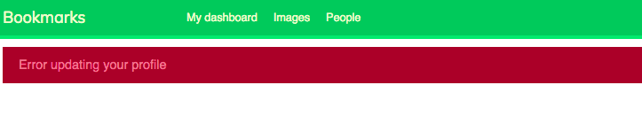
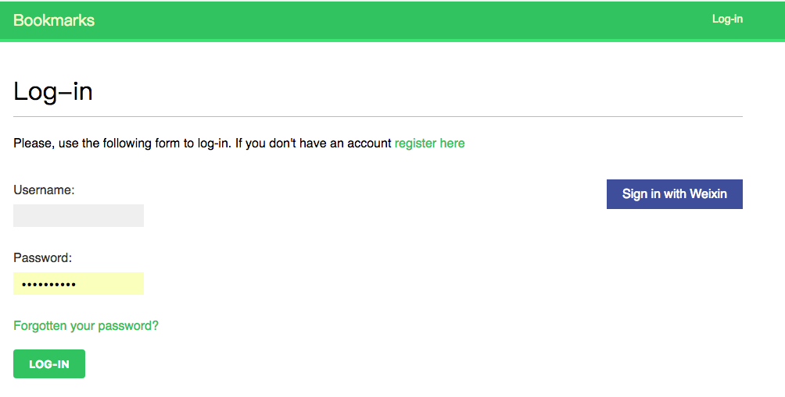

# CH4 创建社交网站

上一章我们学习了如何创建 sitemaps 和 feeds ，并为 blog 应用添加了搜索引擎。这一章，我们将实现用户登录、退出、编辑及重设密码。并将学习如何保存自定义用户资料并为网站添加社交认证。

这一章包含以下内容：

- 使用权限框架

- 创建用户注册视图

- 使用自定义用户资料模型来扩展 User 模型

- 使用 python-social-auth 添加社交权限

我们从新建项目开始。


## 创建一个社交网站项目

我们将创建一个社交应用，用户可以使用应用分享自己上网上时找到的图片。我们将为这个项目实现以下功能：

- 权限系统，具备用户登录、编辑个人资料、更改或者重设密码功能；

- 关注系统，实现用户相互关注的功能；

- 展示分享的图片的功能，以及帮助用户从其它网站分享图片的bookmarklet；

- 活动流，用户可以查看他关注的其他用户的动态。

本章我们将实现第一项功能。

### 启动社交网站项目

打开 teminal 并使用以下命令来为项目创建一个虚拟环境并激活：

```
mkdir env
virtualenv env/bookmarks
source env/bookmarks/bin/activate
```

> 笔者注：
>
> 可以将虚拟环境放到上一个项目 ( blog ) 虚拟环境所在的文件夹下，这时， `mkdir env`  改为 `cd env`。
>
> 笔者这里仍然使用第一章中用到的 PyCharm 创建虚拟环境。


shell 将这样显示激活的虚拟系统：


在虚拟环境中使用以下命令安装 Django ：

```
 pip install django==1.11
```

运行以下命令并创建新的项目：

```
django-admin startporject bookmarks
```

创建完项目的初始结构后，使用以下命令进入项目目录并新建一个名为 account 的应用。

```
cd bookmarks/
django-admin startapp account
```

然后在项目 settings.py 文件的 INSTALLED_APPS 设置的**第一行**添加应用名称：

```python
INSTALLED_APPS = [
    'account',
    'django.contrib.admin',
    'django.contrib.auth',
    'django.contrib.contenttypes',
    'django.contrib.sessions',
    'django.contrib.messages',
    'django.contrib.staticfiles',

]
```

> 笔者注：
>
> 一定要将 ‘ account ’ 放在第一行，它的位置会影响 Django 查找模板的路径。


运行以下命令来同步 INSTALLED_APPS 中默认应用的模型：

```python
python manage.py migrate
```

我们将在项目中使用权限框架创建一个权限系统。


### 使用 Django 权限框架


Django 内置处理用户权限、session、permission 和分组的权限框架。权限系统包括登录、退出、更换密码、重设密码等常用的操作视图。

权限框架位于 django.contrib.auth ，可以供 contrib 的其它模块使用。其实，我们早在第一章中就使用权限框架创建超级用户来访问 blog 应用的 admin网站了。

使用 starproject 命令新建一个 Django 项目时，权限框架已经包含在默认设置中了。我们可以在项目 settings.py 文件的 INSTALLED_APP 中找到 django.contrib.auth 应用，并在 MIDDLEWARE_CLASSES 中找到以下中间件：

- django.contrib.auth.middleware.AuthenticationMiddleware：使用 sessions 将用户与请求联系在一起；

- django.contrib.sessions.middleware.SessionMiddleware：通过请求处理当前 session 。


middleware 是一个类，它包含在请求或响应阶段执行的全局函数。我们将在后面的好几处用到 middleware ，并将在第十三章中学习如何创建自定义 middleware 。

权限框架包含以下模型：

- User ：包含基本字段用户模型，这个模型主要包括以下字段：username、password、email、first_name、last_name 及 is_active 。

- Group : 对用户进行分组的用户组模型；

- Permission :  进行特定操作的标志位模型。


框架还包括默认权限视图和表单，我们将在后面用到它们。

### 创建一个登录视图

我们将使用 Django 权限框架来实现用户登录。视图应该通过以下步骤实现用户登录：

1. 通过表单的 post 请求获得用户名称及密码；

2. 检查数据库中的数据来进行用户认证；

3. 检查用户是否处与激活状态；

4. 登录到网站并开启一个授权的 session 。


首先，我们将创建一个登录表单。在account应用下新建一个 forms.py 文件并添加以下内容：

```python
from django import forms


class LoginForm(forms.Form):
    username = forms.CharField()
    password = forms.CharField(widget=forms.PasswordInput)

```

这个表单用于用户登录验证。注意，我们使用 PasswordInput 控件（ type="password"  的  HTML input 元素）渲染 password 字段。编辑 account 应用的 views.py 文件并添加以下代码：

```python
from django.contrib.auth import authenticate, login
from django.http import HttpResponse
from django.shortcuts import render

from .forms import LoginForm


# Create your views here.
def user_login(request):
    if request.method == 'POST':
        form = LoginForm(request.POST)
        if form.is_valid():
            cd = form.cleaned_data
            user = authenticate(username=cd['username'],
                                password=cd['password'])
            if user is not None:
                if user.is_active:
                    login(request, user)
                    return HttpResponse('Authenticated successfully')
                else:
                    return HttpResponse('Disabled account')
            else:
                return HttpResponse('Invalid login')
    else:
        form = LoginForm()
    return render(request, 'account/login.html', {'form': form})

```

这个登录视图的基本逻辑是 ：使用 GET 请求调用 user_login 视图时，我们使用 form=LoginForm() 新建一个登录表单实例并在模板中展示。当用户使用 POST 请求提交表单时，我们实现以下操作：

1. 使用提交的数据创建表单实例： form=LoginForm(request.POST) ；
2. 检查表单是否有效，如果无效（比如用户没有输入其中一个字段的内容）在模板中展示表单 错误；
3. 如果提交的数据有效，调用 authenticate() 方法对用户进行验证。这个方法的接收 username 和 password ，如果存在满足条件的用户则返回一个 User 对象，如果不存在则返回 None 。如果用户没有通过认证，将返回显示信息的 HttpResponse 。
4. 如果用户验证成功，我们将通过 is_active 属性检查用户是否处于激活状态，is_active 属性是 Django User 模型的一个属性。如果用户没有激活，将放回一个显示信息的 HttpResponse 。
5. 如果用户已激活，则可以登录。我们调用 login() 方法在将用户设置到 session中并返回成功信息。

> 注意：
>
> 注意 autheticate 和 login 的区别：
>
> authenticate() 验证用户，如果正确则返回用户对象；
>
> login() 在当前 session 中设置用户。

现在，我们需要为视图创建 URL 模式。在 account 应用目录下新建一个 urls.py 文件并添加以下代码：

```python
from  django.conf.urls import url

from . import views

urlpatterns = [url(r'^login/$', views.user_login, name='login'),
    
]
```

编辑 bookmarks 项目目录中的 urls.py 文件并添加 accounts 应用中的 URL 模式：

```python 
from django.conf.urls import url,include
from django.contrib import admin

urlpatterns = [
    url(r'^admin/', admin.site.urls),
    url(r'^account/',include('account.urls')),
]
```

现在，已经可以通过 URL 访问视图了。我们可以为视图创建模板了。由于这个应用不必包含任何模板，我们可以从创建可以扩展登录模板的基本模板开始。在 account 应用目录下新建以下文件和路径：



编辑 base.html 文件并添加以下代码：

```HTML

<!DOCTYPE html>
<html>
<head>
    <title></title>
    <link href="" rel="stylesheet">
</head>
<body>
<div id="header">
    <span class="logo">Bookmarks</span>
</div>
<div id="content">
    
    
</div>
</body>
```

这是网站使用的基础模板。与上一个项目采用的方法一样，我们将 CSS 放到主模板中，你可以从本章的代码中找到这些静态文件。将 account 应用的 static/ 目录拷贝到应用中的相同位置，这样就可以使用静态文件了。

基础模板定义了 title 和 content 块，扩展这个模板的其他模板可以填充这两个块。

我们来创建登录表单使用的模板，打开 account/login.html 模板并添加以下代码：

```html


Log-in


  <h1>Log-in</h1>
  
    <p>
      Your username and password didn't match.
      Please try again.
    </p>
  
    <p>Please, use the following form to log-in:</p>
  
  <div class="login-form">
    <form action="" method="post">
      {{ form.as_p }}
      
      <input type="hidden" name="next" value="{{ next }}" />
      <div >
        <a href="" class="rt forget">Forgotten your password？</a>
      </div>
      <p><input type="submit" value="Log-in"></p>
    </form>

  </div>


```

这个模板包含视图中创建的表单实例。由于我们的表单使用 POST 方法提交，我们包含了  模板标签来进行 CSRF 防护。我们在第二章中学习过 CSRF 防护。

现在数据库中还没有任何用户。首先，我们需要创建一个 superuser 来登录 admin网站并管理其他用户。在 terminal 中跳转到项目目录并输入以下命令：python manage.py createsuperuser，填入相应的用户名、邮箱及密码。然后输入 python manage.py runserver 运行开发服务器，并在浏览器中打开 http://127.0.0.1:8000/admin/，使用刚刚创建的超级用户登录 admin网站，你将看到 Django admin网站包括 Django 权限框架的 User 和 Group 模型，看起来是这样的：

使用 admin网站创建一个新用户并浏览器中打开 http://127.0.0.1:8000/account/login/ ，你将看到包含登录表单的模板：


现在，在空着一个字段的情况下提交表单，这种情况下，我们将看到表单无法验证，界面会显示如下错误：


> 笔者注：
>
> 笔者使用的是 Mac Os 系统的 Firefox 浏览器，空着一个字段点击 LOG-IN 按钮出现上述提示。而不像原文中那样出现在 password 之上。


如果输入一个不存在的用户或者错误的密码，将会看到无效登录错误提示。


如果输入有效的凭证，我们将得到一个验证成功的信息：


### 使用 Django 权限视图

Django 权限框架包含一些可以直接使用的表单和视图。我们刚刚创建的登录视图是了解 Django 用户权限系统的好例子。然后，在大多数情况下，我们可以直接使用 Django 的权限视图。

Django 提供以下视图来处理权限问题：

- LoginView ：处理登录表单并使用户登录

- LogoutView ：用户退出登录；

- logout_then_login：用户退出登录并重定向到登录页面。

Django 提供以下视图来处理更改密码：

- PasswordChangeView：处理更改密码表单；

- PasswordChangeDoneView：更改密码成功后显示的页面；

DJango 提供以下视图来帮助用户重设密码：

- PasswordResetView：用户重设密码，它使用 token 生成一次性链接并发送到用户的 e-mail 邮箱中。

- PasswordResetDoneView：显示重设密码的链接成功发送到用户注册时所用的邮箱的提示信息。

- PasswordResetConfirmView：用户设置新密码；

- PasswordResetCompleteView：用户重设密码成功。


> 笔者注：
>
> 除了 logout_then_login 视图，Django by example 列出的权限视图均已经废弃，下面提供的是 Django 权限系统使用的类视图。
>
> 重设密码使用的邮箱要与用户注册时使用的邮箱一致，如果不一致， Django 不会报错，但是不会发送邮件。


上面的视图可以帮助我们在使用账户创建网站时节约很多时间。视图使用可以覆盖的默认设置，比如模板位置或者视图使用的表单。

我们可以从以下网页了解更多内置权限视图的资料https://docs.djangoproject.com/en/1.11/topics/auth/default/#module-django.contrib.auth.views。

### 登录及退出登录视图

 编辑account应用的urls.py文件，并添加以下代码：

```python
from  django.conf.urls import url
from django.contrib.auth import views as auth_views

# from . import views

app_name = 'account'

urlpatterns = [  # previous login view
    # url(r'^login/$', views.user_login, name='login'),
    url(r'^login/$', auth_views.LoginView.as_view(), name='login'),
    url(r'^logout/$', auth_views.LogoutView.as_view(), name='logout'),
    url(r'^logout_then_login/$', auth_views.logout_then_login,
        name='logout_then_login'),
    
]
```

我们注释了之前创建的 user_login 视图的 URL 模式，使用 Django 权限框架的 LoginView 视图。


> 笔者注：
>
> 这里使用了 LoginView.as_view() 和 LogoutView.as_view() 代替了原文中的 login 和 logout。


在 account 应用的模板目录下新建一个 registration 目录。这是 Django 权限视图查找模板的默认路径。在新目录下新建一个 login.html 文件，并添加以下内容：

```python


Log-in


  <h1>Log-in</h1>
  
    <p>
      Your username and password didn't match.
      Please try again.
    </p>
  
      <p>Please, use the following form to log-in: </p>
  
  <div class="login-form">
    <form action="" method="post">
      {{ form.as_p }}
      
      <input type="hidden" name="next" value="{{ next }}" />
      <p><input type="submit" value="Log-in"></p>
    </form>

  </div>

```

这个登录模板与我们之前创建的非常类似。Django 默认使用 django.contrib.auth.forms 中定义的AuthenticationForm 。这个表单尝试验证用户并在用户登录失败时引发验证失败错误。如果用户登录失败，我们可以在模板中使用  检查是否存在验证错误。注意，我们添加了一个隐藏的 <input> 元素来提交 next 的值。这个变量是登录视图从 request 参数中获取到的（如 http://127.0.0.1:8000/account/login/?next=/account/ ）。

next 参数应该是一个 URL ，如果给定了这个参数，Django 登录视图登录成功后将重定向到这个 URL 。

现在，在 registration 模板目录下新建 logged_out.html 模板并添加以下内容：

```python


Logged out


  <h1>Logged out</h1>
  <p>You have been successfully logged out. You can <a href="">log-in again</a>.</p>

```

这是用户退出登录时看到的模板。

为登录和退出登录添加完 URL 模式和模板后，我们的网站已经可以使用 Django 权限系统了。

> 注意：
>
> urlconf 中的 logout_then_login 视图实现退出登录让后重定向到登录页面，因此不需要任何模板。

现在，我们将新建一个视图在用户成功登录后显示公告板。打开 account 应用的 views.py 文件并添加以下代码：

```python

from django.contrib.auth.decorators import login_required


@login_required
def dashboard(request):
    return render(request, 'account/dashboard.html', {'section': 'dashboard'})
```

我们使用权限框架的 login_required 装饰器装饰视图。login_required 装饰器检查当前用户是否有权限。如果用户有权限，则执行被装饰的视图；如果用户没有权限，将重定向到登录 URL 并将这个视图的 URL 作为登录 URL 的next参数传递给登录视图，这样，当用户成功登录用将重定向到要访问的页面。我们之前在登录模板表单中添加的 next 隐藏输入可以正常工作。

我们还定义了一个 section 变量。我们使用这个变量确定用户正在查看网站的哪一部分。许多视图可能对应同一部分，定义每个视图对应的部分是最简单的实现办法。

现在，我们需要为公告板 dashboard 视图创建一个模板，在 templates/account/ 目录下新建一个 dashboard.html 文件，并添加以下代码：

```python


Dashboard


  <h1>Dashboard</h1>
  <p>Welcome to your dashboard.</p>

```

现在，在 accounts 应用的 urls.py 文件中添加以下 URL 模式：

```python
    url(r'^$',views.dashboard,name='dashboard'),
```

编辑项目的 settings.py 文件并添加以下代码：

```python
from django.core.urlresolvers import reverse_lazy

LOGIN_REDIRECT_URL = reverse_lazy('account:dashboard')
LOGIN_URL = reverse_lazy('account:login')
LOGOUT_URL = reverse_lazy('account:logout')
```

这些设置包括：

- LOGIN_REDIRECT_URL：contrib.auth.views.login 视图没有获得 next 参数时，Django 登录后重定向的URL。
- LOGIN_URL：重定向登录 (比如使用 login_required )使用的 URL
- LOGOUT_URL：重定向退出登录的 URL 。

我们使用 reverse_lazy() 通过名称动态创建 URL 。reverse_lazy() 与 reverse() 功能类似，它们的区别在于 reverse_lazy() 可以在项目加载 URL 之前使用。

我们来总结一下之前所做的工作：

- 在项目中添加 Django 内置登录和退出登录视图
- 为两个视图创建自定义模板并定义用户登录后重定向的简单视图
- 最后，配置 Django 设置，默认使用这些视图的 URL 

现在，我们将登录和退出登录链接添加到基本模板中。

为了在各种情况下显示正确链接，我们需要确定当前用户是否处于登录状态。权限中间件将当前用户设置到Request 对象中。我们可以通过 request.user 访问它，无论用户是否授权我们都能获得 request.user 对象 ( 没有授权的用户为 AnonymousUser 实例) 。检查当前用户是否授权的最佳办法是调用 `request.user.is_autherticated()` 。

编辑 base.html 中 ID 为 header 的 <div> 元素：

```python
<div id="header">
    <span class="logo">Bookmarks</span>
    
    <ul class="menu">
      <li class="selected">
        <a href="">My dashboard</a>
      </li>
      <li class="selected">
        <a href="#">Images</a>
      </li>
      <li class="selected">
        <a href="#">People</a>
      </li>
    </ul>
  

  <span class="user">
    
      Hello {{ request.user.first_name }},
      <a href="">Logout</a>
    
      <a href="">Log-in</a>
    
  </span>
</div>
```

你可以看到，只有授权用户可以看到网站目录。我们还检查 section 来为对应的 <li> 元素添加 selected 类属性从而使用 CSS 高亮显示当前 section 。如果用户已经授权，我们会显示当前用户名及退出登录链接；如果用户未授权，我们将只显示登录链接。

现在在浏览器中打开 http://127.0.0.1:8000/account/login/ ，应该可以看到登录页面。输入有效的用户名和密码并点击登录按钮，我们应该可以看到：


我们可以看到 My dashboard 处于高亮状态，这是由于它添加了 selected 类。由于用户已经授权，所以 header 右侧显示用户名及退出登录链接。点击退出登录链接，你应该可以看到：


在这个页面中，我们可以看到用户已经退出登录，我们无法看到网站的目录，header 右侧的链接也变为了登录。

如果你看到的是 Django admin 网站的退出登录页面，那么请检查项目 settings.py 文件中 INSTALLED_APPS 中的应用顺序，检查 account 应用是否位于 django.contrib.admin应用。这两个应用的模板位于相同的相对位置，对于相同相对位置的模板，Django 将加载第一个找到的模板。

### 更改密码

用户登录后，还需要提供更改密码的功能。我们将使用 Django 权限视图来实现更改密码。打开 account 应用的 urls.py 文件并添加以下代码：

```python
    # change password urls
    url(r'^password_change/$', auth_views.PasswordChangeView.as_view(
        success_url=reverse_lazy('account:password_change_done')),
        name='password_change'),
    url(r'^password_change/done/$', auth_views.PasswordChangeDoneView.as_view(),
        name='password_change_done'),
```

> 笔者注：
>
> 原文使用的是 password_change 及 password_change_done 函数，由于 auth 视图中的函数将被基类函数代替，因此这里使用的是 PasswordChangeView 和 PasswordChangeDone 类视图。
>
> 运行时 django.contrib.auth.views 中的 success_url = reverse_lazy('password_change_done') 报错，我们在 PasswordChangeView.as_views 中设置 `success_url=reverse_lazy('account:password_change_done')`。

PasswordChange 视图将处理更改密码表单，PasswordChangeDone 将在用户成功更改密码后显示成功消息。我们来为每个视图创建相应的模板。

在 account 应用 templates/registration/ 目录下新建 password_change_form.html 的文件。并添加以下代码:

```python


Change you password


  <h1>Change you password</h1>
  <p>Use the form below to change your password.</p>
  <form action="." method="post">
    {{ form.as_p }}
    <p><input type="submit" value="Change"></p>
    
  </form>

```

这个模板包含更改密码的表单。现在，在相同的目录下新建 password_change_done.html 的文件并添加以下代码：

```python


Password changed


  <h1>Password changed</h1>
  <p>Your password has been successfully changed.</p>

```

这个模板只包括成功更改密码后的成功信息。

现在在浏览器中打开 http://127.0.0.1:8000/account/password_change/ ，如果用户没有登录，浏览器将重定向的登录页面，当成功授权后，你见看到以下的更改密码页面：


> 笔者注：
>
> New password confirmation 之前的列表信息为新密码设置规则，如果不想显示，可以在 CSS 中添加`.helptext{display:none}`。

输入当前密码及新密码并点击Change按钮，你将看到成功页面：


退出登录并使用新密码再次登录以验证更改密码功能。

### 重设密码

在 account 应用的 views.py 中添加以下代码:

```python
from django.contrib.auth.views import PasswordResetView,PasswordResetConfirmView

class PasswordReset(PasswordResetView):
    from_email = 'email-username@hotmail.com'
    success_url = reverse_lazy('account:password_reset_done')


class PasswordResetConfirm(PasswordResetConfirmView):
    success_url = reverse_lazy('account:password_reset_complete')
```

> 笔者注：
>
> 这里为 PasswordResetView 设置了其他属性，因此定义了继承权限类的自定义类。
>
> 第二章测试结果只有 hotmail 邮箱可以正常实现发送邮件，因此这里使用 hotmail 邮箱。
>
> 这里的 email-username@hotmail.com 要与项目 settings.py 文件中设置的 EMAIL_HOST_USER 的值保持一致。项目 settings.py 中的设置为：
>
> ```python 
> # e-mail setting
> EMAIL_HOST = 'smtp-mail.outlook.com'
> EMAIL_HOST_USER = 'email-username@hotmail.com'
> EMAIL_HOST_PASSWORD = 'email-password'
> EMAIL_PORT = 587
> EMAIL_USE_TLS = True
> ```

向 account 应用添加下面的 URL 模式以实现重设密码：

```python
	url(r'^password_reset/$', views.PasswordReset.as_view(),
        name='password_reset'),
    url(r'^password_reset/done/$', auth_views.PasswordResetDoneView.as_view(),
        name='password_reset_done'),
    url(r'^password_reset/(?P<uidb64>[0-9A-Za-z_\-]+)/(?P<token>.+)/$',
        views.PasswordResetConfirm.as_view(), name='password_reset_confirm'),
    url(r'^password_reset/complete/$',
        auth_views.PasswordResetCompleteView.as_view(),
        name='password_reset_complete'),
        
```

在 account 应用 templates/registration/ 目录下新建 password_reset_form.html 文件并添加以下代码：

```html


Reset your password


  <h1>Forgotten your password?</h1>
  <p>Enter your e-mail address to obtain a new password.</p>
  <form action="." method="post">
    {{ form.as_p }}
    <p><input type="submit" value="Send e-mail"></p>
    
  </form>

```

现在，在相同目录下新建 password_reset_email.html 的文件并添加以下代码：

```html
Someone asked for password reset for email {{ email }}. Follow the link below:
{{ protocol }}://{{ domain }}
Your username, in case you've forgotten: {{ user.get_username }}
```

这个模板用于渲染发送给用户的重设密码邮件。

在相同的目录下新建 password_reset_done.html 文件并添加以下代码：

```html


Reset your password


  <h1>Reset your password</h1>
  <p>We've emailed you instructions for setting your password.</p>
  <p>If you don't receive an email, please make sure you've entered the address you registered with.</p>

```

在相同目录下新建 password_reset_confirm.html 文件，并添加以下代码：

```html


Reset your password


  <h1>Reset your password</h1>
  
    <p>Please enter your new password twice:</p>
    <form action="." method="post">
      {{ form.as_p }}
      
      <p><input type="submit" value="Change my password" /></p>
    </form>
  
    <p>The password reset link was invalid, possibly because it has already been used. Please request a new password reset.</p>
  

```

我们将检查添加的链接是否有效。Django 重设密码视图设置该变量并放到模板 context 中。如果链接有效将显示用户密码重设表单。

在相同目录下新建名为 password_reset_complete.html 的文件并添加以下代码：

```html


Password reset


<h1>Password set</h1>
  <p>Your password has been set. You can <a href="">log in now</a></p>

```

最后，编辑 account 应用的 registration/login.html 模板并在 <form> 元素后添加下面的代码：

```
<p><a href="">Forgotten your password?</a>
</p>
```

现在，在浏览器中打开 http://127.0.0.1:8000/account/login/ 并点击**Forgotten your passward?** 链接，我们应该看到以下页面：


我们需要在项目的 settings.py 文件中添加 SMTP 配置，这样 Django 才能发送邮件。我们已经在第二章中学习了如何发送邮件。

然而，在开发过程中我们可以配置 Django 将 e-mail 输出到标准输出，而不是通过 SMTP 服务器进行发送。Django 提供一个 e-mail 后端向 console 输出 e-mail 。编辑项目的 settings.py 文件并添加以下代码：


```python 
EMAIL_BACKEND='django.core.mail.backends.console.EmailBackend'
```

EMAIL_BACKEND 用于设置发送邮件所使用的类。

> 笔者注：
>
> 如果不设置 EMAIL_BACKEND ，那么你将在邮箱中收到一封邮件：
>
> 


回到浏览器，输入一个已有用户注册时使用的e-mail地址，并点击 **Send e-mail** 按钮，我们将看到以下页面：


查看一下运行开发服务器的 console ，将会看到生成了这样一封邮件：

```
Content-Type: multipart/alternative;
MIME-Version: 1.0
Subject: Password reset on 127.0.0.1:8000
From: from_username@hotmail.com
To: to_username@qq.com
Date: Mon, 20 Nov 2017 07:01:54 -0000
Message-ID: <20171120070154.1292.6759@appledemacbook.local>
Content-Type: text/html; charset="utf-8"
MIME-Version: 1.0
Content-Transfer-Encoding: 7bit

Someone asked for password reset for email 80884678@qq.com. Follow the link below:
http://127.0.0.1:8000/account/password_reset/Mg/4rb-b850efa655cc38f792e7/
Your username, in case you've forgotten: testuser

```

e-mail 使用之前创建的 password_reset_email.html 模板渲染。重设密码的 URL 包含一个 Django 动态生成的 token 。在浏览器中打开邮件中的链接，你将看到以下页面：


重设密码页面与 password_reset_confirm.html 对应，输入新密码并点击 **Change my password** 按钮。Django 将对密码进行加密并保存到数据库中，你将看到一个成功页面：


现在，我们可以使用新密码重新登录。每个重设密码的 token 只能使用一次。如果再次打开重设密码的链接，你将定向到 token 无效的页面。


> 笔者注：
>
> token 无效的页面：
>
> 

现在，我们已经在项目中集成了 Django 权限框架视图。这些视图在大多数情况适用。当然，如果需要实现其它行为，你也可以使用自己的视图。


## 用户注册和用户资料


现在，注册的用户可以登录、退出、更改密码和忘记密码时重置密码。接下来，我们新建视图来实现用户注册。


### 用户注册

我们新建一个简单视图来实现用户登录网站。首先，我们需要创建一个表单来输入用户名、真实姓名及密码。编辑 account 应用下的 forms.py 文件，并添加以下代码：

```python
from django.contrib.auth.models import User

class UserRegistrationForm(forms.ModelForm):
    password = forms.CharField(label='Password', widget=forms.PasswordInput)
    password2 = forms.CharField(label='Repeat password',
                                widget=forms.PasswordInput)

    class Meta:
        model = User
        fields = ('username', 'first_name', 'email')

    def clean_password2(self):
        cd = self.cleaned_data
        if cd['password'] != cd['password2']:
            raise forms.ValidationError('Password don\'t match')
        return cd['password2']
```

我们为 User 模型创建了一个模型表单。表单只包括模型的 username 、first_name 、email 字段。这些字段根据模型字段类型来进行验证。比如，如果用户注册时使用已经存在的用户名，将会引发验证错误。我们添加了两个额外字段 password 和 password2 来输入密码及确定密码。clean_password2() 方法检查第二次输入的密码是否与第一次输入的密码一致，如果不一致则验证失败。当我们调用表单的 is_valid() 方法时进行这些验证。我们可以为任意字段提供`clean_<filedname>()`函数来处理数据并或引发异常。表单还包括 clean() 方法来验证整个表单，这对于验证相互依赖的字段非常有用。

Django 还提供 UserCreationForm（ 位于 django.contrib.auth.forms ) 表单 ，这个表单与我们刚创建的表单非常类似。

编辑 account 应用的 views.py 文件并添加以下代码：

```python
from .forms import LoginForm, UserRegistrationForm

def register(request):
    if request.method == 'POST':
        user_form = UserRegistrationForm(request.POST)
        if user_form.is_valid():
            # create a new user object but avoid saving it yet
            new_user = user_form.save(commit=False)
            # set the chosen password
            new_user.set_password(user_form.cleaned_data['password'])
            # save the User object
            new_user.save()
            return render(request, 'account/register_done.html',
                          {'new_user': new_user})
        else:
            return render(request, 'account/register.html',
                          {'user_form': user_form})
    else:
        user_form = UserRegistrationForm()
        return render(request, 'account/register.html',
                      {'user_form': user_form})
```

创建用户账户的视图非常简单。为了安全起见，我们不直接保存用户输入的原始密码，通过使用 User 模型的 set_password() 方法进行加密后保存。

现在，编辑 account 应用的 urls.py 文件，并添加以下 URL 模式：

```python
url(r'^register/$',views.register,name='register'),
```

最后，在 templates/account 目录下，新建名为 register.html 的文件，并添加以下代码：

```HTML


Create an account


    <h1>Create an account</h1>
    <p>Please,sign up using the following form:</p>
    <form action="." method="post">
        {{ user_form.as_p }}
        
        <p><input type="submit" value="Create my account"></p>
    </form>


```

在相同目录下，新建名为 register_done.html 文件，并添加以下代码：

```python


Welcome


    <h1>Welcome {{ new_user.first_name }}!</h1>
    <p>Your account has been successfully created. Now you can <a
            href="">log in</a>.</p>

```

现在，在浏览器中打开 http://127.0.0.1:8000/account/register/ ，将会看到以下页面:



新用户输入详细信息并点击 Create my account 按钮。如果所有字段都有效，将创建用户，并看到以下页面：



点击 **log in** 链接跳转到登录页面，然后使用新建的用户名和密码进行登录来验证注册是否成功。

现在，可以将注册链接添加到登录模板中，编辑 registration/login.html 模板，将模板中的：

```
<p>Please, use the following form to log-in:</p>
```


```HTML

      <p>Please, use the following form to log-in. If you don't have an account<a href="">register here</a></p>
```

这样可以从登录页面跳转到注册页面。

### 扩展用户模型

处理用户账户时，我们发现 Django 权限框架的 User 模型适用于大多数情况。但是， User 模型只包括基本字段，我们有时希望扩展 User 模型来包含额外数据。为 User 模型添加额外数据最好的方法是新建一个资料模型来包含所有额外字段及一个 Django  User 模型一对一关系的字段。

编辑 account 应用的 models.py 文件，并添加以下代码：

```python
from django.conf import settings
from django.db import models


# Create your models here.
class Profile(models.Model):
    user = models.OneToOneField(settings.AUTH_USER_MODEL)
    date_of_birth = models.DateField(blank=True, null=True)
    photo = models.ImageField(upload_to='users/%Y/%m/%d', blank=True)

    def __str(self):
        return 'Profile for user {}'.format(self.user.username)
```

> 注意：
>
> 为了保证代码通用，我们使用 get_user_model() 方法获取用户模型，在模型中使用 AUTH_USER_MODEL 表示用户模型（而不是直接使用User模型）。
>

user 一对一字段帮助我们将 user 和 profile 联系在一起。photo 字段是一个 ImageField 字段。我们需要安装Python 库文件 PIL (Python Imaging Library) 或 Pillow 来管理图像，我们可以运行以下命令安装 Pillow ：

```python
pip install Pillow
```

在开发服务器中保存用户上传的图像文件，还需要在项目的 settings.py 文件中添加以下设置：

```python
MEDIA_URL = '/media/'
MEDIA_ROOT = os.path.join(BASE_DIR, 'media/')
```

MEDIA_URL 是用户上传的媒体文件的基础 URL ，MEDIA_ROOT 是文件的本地路径。我们根据项目路径动态创建路径以保证代码更加通用。

现在，编辑 bookmarks 项目的 urls.py 文件并将代码修改为：

```python
from django.conf import settings
from django.conf.urls import url, include
from django.conf.urls.static import static
from django.contrib import admin

urlpatterns = [url(r'^admin/', admin.site.urls), 
               url(r'^account/',include('account.urls',namespace='account',app_name='account')), ]

if settings.DEBUG:
    urlpatterns += static(settings.MEDIA_URL, document_root=settings.MEDIA_ROOT)
```

这样，Django 开发服务器可以在开发期间提供媒体文件管理服务。

static() 帮助函数用于开发过程但不能用于生产。不要在生产过程中使用 Django 处理静态文件。

打开 shell 并运行以下命令来新建模型迁移文件：

```python 
python manage.py makemigrations
```

我们将看到这些输出：

```
Migrations for 'account':
  account/migrations/0001_initial.py
    - Create model Profile
```

然后同步数据库：

```python
python manage.py migrate
```

我们将看到以下输出：

```
Operations to perform:
  Apply all migrations: account, admin, auth, contenttypes, sessions
Running migrations:
  Applying account.0001_initial... OK
```

编辑 account 应用的 admin.py 文件，将 Profile 模型注册到 admin 网站：

```python
from django.contrib import admin

from .models import Profile


# Register your models here.
class ProfileAdmin(admin.ModelAdmin):
    list_display = ['user', 'date_of_birth', 'photo']


admin.site.register(Profile, ProfileAdmin)
```

使用 python manage.py runserver 命令运行开发服务器，现在可以在 admin网站中看到 Profile 模型了：



现在我们实现用户在网站上编辑自己的 profile 的功能。在 account 应用的 forms.py 文件中添加以下代码:

```python
from .models import Profile

class UserEditForm(forms.ModelForm):
    class Meta:
        model = User
        fields = ('first_name', 'last_name', 'email')


class ProfileEditForm(forms.ModelForm):
    class Meta:
        model = Profile
        fields = ('date_of_birth', 'photo')
```

添加的表单包括:

- UserEditForm：帮助用户编辑他们存储在内置 User 模型中的 first_name 、last_name 和 email 。

- ProfileEditForm：帮助用户编辑保存到自定义 Profile 模型中的额外内容。用户可以编辑他们的出生日期并为自己的主页上传照片。


编辑 account 应用的 views.py 文件，并导入 Profile 模型：

```python 
from .models import Profile
```

在 register 视图的 new_user.save() 之前添加以下代码：

```python
profile = Profile.objects.create(user=new_user)
```

这样在用户注册时我们为用户创建了一个空的 profile 。当然我们还可以使用 admin网站为创建 Profile 模型之前的用户手动创建 Profile 对象。

现在，用户可以编辑他们的 profile 了。在 views.py 文件中添加以下内容:

```python
from .forms import LoginForm, UserRegistrationForm, UserEditForm, \
    ProfileEditForm


@login_required
def edit(request):
    if request.method == 'POST':
        user_form = UserEditForm(instance=request.user, data=request.POST)
        profile_form = ProfileEditForm(instance=request.user.profile,
            data=request.POST, files=request.FILES)
        if user_form.is_valid() and profile_form.is_valid():
            user_form.save()
            profile_form.save()
    else:
        user_form = UserEditForm(instance=request.user)
        profile_form = ProfileEditForm(instance=request.user.profile)
    return render(request, 'account/edit.html',
                  {'user_form': user_form, 'profile_form': profile_form})
```

这里使用 login_required 装饰器限制只有授权用户才能编辑自己的文件。在这种情况下，我们使用了两个模型表单：UserEditForm 存储内置 User 模型的数据，ProfileEditForm 存储额外的文件数据。为了验证提交的数据，我们检查两个表单的 is_valid() 方法是否都为 True 。在这种情况下，我们保存两个表单实现数据库相应记录的更新。

在 account 应用的 urls.py 文件中添加以下 URL 模式:

```python
url(r'^edit/$',views.edit,name='edit'),
```

最后，为视图创建模板，在 templates/account 目录下新建 edit.html 文件，并添加以下代码：

```python


Edit your account


    <h1>Edit your account</h1>
    <p>You can edit your account using the following form:</p>
    <form action="." method="post" enctype="multipart/form-data">
        {{ user_form.as_p }}
        {{ profile_form.as_p }}
        
        <p><input type="submit" value="Save changes"></p>
    </form>

```

> 注意：
>
> 我们在 form 中添加 enctype="multipart/form-data" 来上传文件。我们使用一个 HTML 表单来提交user_form 和 profile_form 表单。


注册一个新用户，并在浏览器中打开 http://127.0.0.1:8000/account/edit/  ，将看到以下页面:



现在，我们可以编辑 dashboard 页面来添加编辑个人资料和更改密码页面的链接。打开account/dashboard.html 模板并将：

```
<p> Welcome to your dashboard.</p>
```

更改为：

```python 

    <p>Welcome to your dashboard.You can
        <a href="">edit your profile</a> or
        <a href="">change your password</a>.
    </p>
```

现在，用户可以在 dashboard 中访问个人资料编辑页面和更改密码页面了。


### 使用用户自定义模型


Django 还提供使用自定义模型代替 User 模型的方法。自定义用户模型需要继承 AbstractUser 类(以抽象类的形式提供默认用户的全部操作)。详细资料见 https://docs.djangoproject.com/en/1.11/topics/auth/customizing/#substituting-a-custom-user-model 。

使用自定义用户模型将更加灵活，但是将增加使用 User 模型的即插即用应用的集成难度。

### 使用消息框架

处理用户动作时，我们可能希望告诉用户结果。Django 内置消一个息框架来帮助我们为用户提供即时提示。消息框架位于 django.contrib.messages ，新建项目时这个框架默认添加到了 settings.py 文件的 INSTALLED_APPS 中。settings.py 的 MIDDLEWARE_CLASSES 也包含 django.contrib.message.middlewarer.MessageMiddleware 中间件。使用消息框架添加消息非常简单。消息保存在数据库中并在用户下一个请求中显示。我们可以在视图的消息框架中导入消息模块并使用快捷方式添加新消息：

```python
from django.contrib import messages

messages.error(request,'Something Went wrong')
```

我们可以使用 add_message() 或以下快捷方式新建消息：

- success()：动作成功后显示的消息。

- info()：信息消息。

- warning()：暂时没有失败但是可能立即失败的消息。

- error()：没有成功或失败消息。

- debug()：在生产环境中将会移除或忽略的调试消息。


我们来为用户提供信息。由于消息框架用于整个项目。我们可以在基础模板中向用户提供消息。打开 base.html 模板并在 id 为 header 的 <div> 元素和 id 为 content 的 <div> 元素之间添加以下代码：

```

    <ul class="messages">
        
            <li class="{{ message.tags }}">
                {{ message|safe }}
                <a href="#" class="close">✖</a>
            </li>
        
    </ul>

```

这个消息框架内置的内容处理器在 request 内容中添加 message 变量。这样我们可以在模板中使用这个变量来为用户显示当前信息。

现在，我们修改 edit 视图来使用消息框架。编辑 account 应用的 views.py 文件并修改 edit 函数:

```python
from django.contrib import messages

@login_required
def edit(request):
    if request.method == 'POST':
        user_form = UserEditForm(instance=request.user, data=request.POST)
        profile_form = ProfileEditForm(instance=request.user.profile,
                                       data=request.POST, files=request.FILES)
        if user_form.is_valid() and profile_form.is_valid():
            user_form.save()
            profile_form.save()
            messages.success(request, 'Profile updated successfull')
        else:
            messages.error(request, 'Error updating your profile')
    else:
        user_form = UserEditForm(instance=request.user)
        profile_form = ProfileEditForm(instance=request.user.profile)
    return render(request, 'account/edit.html',
                  {'user_form': user_form, 'profile_form': profile_form})

```

当用户成功更新自己的资料后将显示成功信息。如果表单无效则会显示失败信息。

在浏览器中打开 http://127.0.0.1:8000/account/edit/ 并且编辑资料。当文件成功更新后，可以看到下面的消息：



表单无效时，应该可以看到以下消息:



## 创建自定义权限后端

Django 可以使用不同的权限后端。AUTHENTICATION_BACKENDS 设置是项目使用的权限后端列表。默认情况下使用这个设置 : 

```python
('django.contrib.auth.backends.ModelBackend',)
```


默认的 ModelBackend 使用 django.contrib.auth 的 User 模型对用户进行验证，这种方式适用于大多数项目。然而，我们可以创建自定义后端来使用 LDAP 或其他系统来实现用户认证。

更多自定义权限消息包括 https://docs.djangoproject.com/en/1.11/topics/auth/customizing/#other-authentication-sources。

每次使用 django.contrib.auth 的 authenticate() 函数，Django 依次使用 AUTHENTICATION_BACKENDS 中的每个后端直到其中一个可以实现授权。只有所有的后端都认证失败，他/她才无法登陆网站。

Django 提供了一个简单的方法来自定义权限后端。一个权限后端是一个类，它需要提供下面两个方法：

- authenticate()：输入用户凭证。如果用户成功授权则返回 True ，否则返回 False 。
- get_user()：输入用户ID参数并返回 User 对象。

创建自定义权限后端与创建 Python 类一样简单。我们将创建权限后端帮助用户在网站中使用邮箱登录。

在 account 应用目录下新建一个 authentication.py 文件，并添加以下代码：

```python
from django.contrib.auth.models import User


class EmailAuthBackend(object):
    """
    Authenticate using e-mail account.
    """

    def authenticate(self, username=None, password=None):
        try:
            user = User.objects.get(email=username)
            if user.check_password(password):
                return user
            return None
        except User.DoesNotExist:
            return None

    def get_user(self, user_id):
        try:
            return User.objects.get(pk=user_id)
        except User.DoesNotExist:
            return None
```

这是一个简单的后端，authenticate() 方法接收 username 和 password 参数，我们将使用不同的参数名称，但是使用 username 和 password 可以保证后端直接在权限框架视图中使用。代码这样工作：

- authenticate() ：尝试使用 e-mail 获取用户，并使用 User 模型内置的 check_password() 方法检查密码。这个方法对密码进行哈希处理并与数据库中的密码进行比较。

- get_user() ：通过 user_id 参数设置的 ID 获取用户。Django 使用授权用户的后端为用户 session 获取 User 对象。

编辑项目的 settings.py 文件并添加以下内容:


```python
AUTHENTICATION_BACKENDS = (
    'django.contrib.auth.backends.ModelBackend',
    'account.authentication.EmailAuthBackend',
    )
```

我们保留默认的 ModelBackend 来使用用户和密码进行登录，并且添加了 email 权限后端。现在在浏览器中打开 http://127.0.0.1:8000/account/login/ 。Django 将尝试使用每个后端验证用户，现在你也可以使用用户名或者 e-mail 进行登录。

> 注意:
>
> AUTHENTICATION_BACKENDS 列表中的后端顺序很重要。如果多个后端都验证用户凭证有效，Django 将使用第一个验证成功的后端。


## 为网站添加社交权限

****

我们还可能希望使用微信等服务进行网站授权。 Python-social-auth 是一个简化网站添加社交认证过程的 Python模块。这个模块可以实现通过用户的微信等账号登录网站。我们可以从以下地址找到这个模块的代码：https://github.com/python-social-auth。这个模块为各种 Python 框架（包括 Django )提供社交权限后端。

> 笔者注：
>
> 原文使用 Facebook、Twitter、Google 等服务，考虑到需要翻墙，本节更改为使用微信，后续会添加使用微博、豆瓣等服务的方法。
>
> 原文 python-social-auth 的代码地址为 https://github.com/omab/python-social-auth/ ，该地址的代码在 2016 年 12 月 3 日弃用，代码迁移到 https://github.com/python-social-auth ，新代码拆分为相互隔离的小模块以便于使用。新代码的说明文档地址为 http://python-social-auth.readthedocs.io/en/latest/ ，适用于 django 的模块的说明文档地址为 http://python-social-auth.readthedocs.io/en/latest/configuration/django.html 。下面的过程使用新的 python-social-auth 实现。


我们可以使用 pip 安装这个模块，打开 console 并运行以下命令：

```python 
pip install social-auth-app-django
```

然后， 在项目 settings.py 文件的 INSTALLED_APPS 中添加 social_django  ：

```python 
INSTALLED_APPS = ['account',
                  'django.contrib.admin',
                  'django.contrib.auth',
                  'django.contrib.contenttypes',
                  'django.contrib.sessions',
                  'django.contrib.messages',
                  'django.contrib.staticfiles',
                  'social_django' ]
```

这是向 Django 项目添加 python-social-auth 的默认应用，现在，运行以下命令来将 social_django 模型同步到数据库：

```python 
python manage.py migrate	
```

你应该看到 default 应用的迁移：

```python
Operations to perform:
  Apply all migrations: account, admin, auth, contenttypes, sessions, social_django
Running migrations:
  Applying social_django.0001_initial... OK
  Applying social_django.0002_add_related_name... OK
  Applying social_django.0003_alter_email_max_length... OK
  Applying social_django.0004_auto_20160423_0400... OK
  Applying social_django.0005_auto_20160727_2333... OK
  Applying social_django.0006_partial... OK
  Applying social_django.0007_code_timestamp... OK
  Applying social_django.0008_partial_timestamp... OK
```

python-social-auth 为很多服务提供后端，可以在这里查找支持的所有后端 http://python-social-auth.readthedocs.io/en/latest/intro.html#features 。

我们将添加社交后端实现微信登录。

我们需要为项目添加社交登录 URL 模式。打开 bookmarks 项目的 urls.py 文件，并添加以下代码：

```python
urlpatterns = [url(r'^admin/', admin.site.urls),
               url(r'^account/',include('account.urls',namespace='account')),
               url(r'^', include('social_django.urls', namespace='social'))]
```

社交权限正常工作需要一个主机名称，这是由于部分社交服务不允许重定向到 127.0.0.1 或者 localhost 。为了修正这个问题，如果你使用的是 Linux 或者 Mac OS ，编辑/etc/hosts文件并添加下面一行:

```
127.0.0.1 mysite.com
```

这条命令告诉电脑将 mysite.com 主机名指向自己的机器。如果使用 Windows，hosts 文件的位置在 C:\Winwows\System32\Drivers\etc\hosts 。 

为了验证主机重定向生效，在浏览器中打开 http://mysite.com:8000/account/login/ ，如果出现应用的登录页面就一切正常。

### 使用微信登录

为了让用户使用微信账号登录网站，在项目的 settings.py 文件的 AUTHENICATION_BACKENDS 设置中添加以下内容：
```
'social_core.backends.weixin.WeixinOAuth2',
```
为了网站能够使用微信扫码登录，我们需要微信开发账户。在浏览器中打开 https://mp.weixin.qq.com/ 进行注册。

> 笔者注：
>
> 笔者这里注册的服务号，并且进行了微信认证。

注册完成后后获得 App Id 和 APP secret，将它们拷贝到项目的 settings.py 文件，

```
SOCIAL_AUTH_WEIXIN_KEY = 'my_appid'
SOCIAL_AUTH_WEIXIN_SECRET = 'my_appsecret'
```
此外，还需要设置 SCOPE ：

```
SOCIAL_AUTH_WEIXIN_SCOPE = []
```
> 笔者注：
> social-django 内部已经默认设置了默认的 SCOPE 为 snsapi_login，这里应该无需再次设置，但是不设置 social-django 会报错。
>

最后，打开 registration/login.html 模板并在 content 模块中添加以下代码：

 ```
 <div class="social">
    <ul>
        <li class="facebook"><a href="">Sign in
            with Weixin</a></li>
    </ul>
</div>
 ```
> 笔者注：
> 这里可以从微信公众平台下载微信图标，使用微信图标代替蓝色底框。

在浏览器中打开 http://mysite.com:8000/account/login/ ，现在，登录页面变成这样的：




点击右侧的 Login with Weixin 按钮，我们将重定向到微信接口，如果一切正常，你应该可以看到一个二维码页面，下面贴出的是简书的微信扫码链接：

https://open.weixin.qq.com/connect/qrconnect?appid=wxe9199d568fe57fdd&client_id=wxe9199d568fe57fdd&redirect_uri=http%3A%2F%2Fwww.jianshu.com%2Fusers%2Fauth%2Fwechat%2Fcallback&response_type=code&scope=snsapi_login#wechat_redirect

对应的页面会出现二维码，这样，即可实现扫码登录。


> 笔者注：
>
> 测试过程中生成的扫码链接为：
>
> https://open.weixin.qq.com/connect/qrconnect?scope=snsapi_login&state=QgY1LvHJfdAqKrvEIY6AZ2y1byZJimGR&redirect_uri=http:%3A%2F%2Fmyauthsite.net%2Fsocialcomplete%2Fweixin&response_type=code&appid=my_appid#wechat_redirect
>
> 测试过程中，使用注册的 appid 代替 my_appid，笔者使用该链接出现了 SCOPE 错误的消息，百度可能是参数顺序的问题，于是将链接改为：
>
> https://open.weixin.qq.com/connect/qrconnect?appid=my_appid&redirect_uri=http:%3A%2F%2Fmyauthsite.net%2Fsocialcomplete%2Fweixin&response_type=code&scope=snsapi_login&state=QgY1LvHJfdAqKrvEIY6AZ2y1byZJimGR#wechat_redirect
>
> 问题仍然存在。原因可能在于刚刚修改为微信授权域名，稍后会继续测试。
>
> 此外，扫码登录还需要进行后续处理，譬如新用户跳转页面，老用户跳转页面，如何使用用户信息等，上述测试正常后，会另写一篇文章详细描述。
>


##总结

本章，我们学习了任何为网站创建权限系统以及如何创建个人页面，以及为网站添加社交权限。

下一章，我们将学习如何创建图像 bookmarking 系统，生成图像缩略图，并创建 AJAX 视图。
