# CH4 创建社交网站

在前面一章中，我们学习了如何创建sitemaps和feeds，并且为blog应用添加了搜索引擎。在这一章中，我们将实现用户登录、退出、编辑及重设密码。我们将学习如何创建自定义简介并为网站添加社交权限。

这一章将包含以下内容：

使用权限框架

创建用户注册视图

使用自定义简介模型扩展User模型

使用python-social-auth添加社交权限

我们从创建新的项目开始。

##创建一个社交网站项目

我们将创建一个社交应用来帮助用户分享他们在网上找到的图片。这个项目需要实现以下功能：

- 用户注册使用的权限系统，登录、编辑个人资料、更改或者重设密码；

- 关注系统来帮助用户相互关注；

- 展示分享的图片及帮助用户从任何网站分享图片的bookmarklet；

- 用户可以查看他关注的每个用户的动态。

本章我们将实现第一点。

### 启动社交网站项目

打开teminal并使用以下命令来为项目创建一个虚拟环境并激活：

```
mkdir env
virtualenv env/bookmarks
source env/bookmarks/bin/activate
```

shell将这样显示激活的虚拟系统：

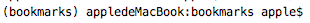

在虚拟环境中使用以下命令安装Django：

```
 pip install django
```

运行以下命令并创建新的项目：

```
django-admin startporject bookmarks
```

创建完项目的初始结构后，使用以下命令进入项目目录并创建一个新的名为account的应用。

```
cd bookmarks/
django-admin startapp account
```

然后在项目settings.py文件的INSTALLED_APPS中第一行添加应用名称：

```python
INSTALLED_APPS = [
    'account',
    'django.contrib.admin',
    'django.contrib.auth',
    'django.contrib.contenttypes',
    'django.contrib.sessions',
    'django.contrib.messages',
    'django.contrib.staticfiles',

]
```

> 注意：这里一定要将‘account’放在第一行，它将影响后续django查找模板。

运行以下命令来同步INSTALLED_APPS中默认应用的模型：

```
python manage.py migrate
```

我们将在项目中使用权限框架创建一个权限系统。

### 使用Django权限框架

Django内置可以处理用户权限、session、permission和用户分组的权限框架。权限系统包括登录、退出、更换密码、重设密码等常用操作的视图。

权限框架位于django.contrib.auth，该权限框架也用于contrib的其它部分。我们已经在第一章中使用过权限框架来创建超级用户以便访问blog应用的admin网站。

当使用starproject命令新建一个Django项目时，项目的默认设置已经包括权限框架。我们可以在settings.py的INSTALLED_APP中找到django.contrib.auth应用并且在MIDDLEWARE_CLASSES中找到以下中间件：

django.contrib.auth.middleware.AuthenticationMiddleware：使用session将用户与请求联系在一起；

django.contrib.sessions.middleware.SessionMiddleware：处理当前session。

middleware是一个包含在请求或响应过程中执行的函数的类。本书中我们有好几处使用middleware。你将在第十三章中学习如何新建自定义middleware。

权限框架包括以下模型;

User：用户模型，这个模型主要包括以下字段：username、password、email、first_name、last_name及is_active。

Group:用于用户分类的组模型；

Permission: 进行特定操作的标志位。

框架还包括后续需要使用的默认权限视图和表单。

### 创建一个登录视图

我们使用Django权限框架来允许用户登录网站。我们视图应该通过以下步骤实现用户登录：

1. 通过表单post获得用户名称及密码；

2. 通过数据库中的数据对用户进行认证；

3. 检查用户是否处与激活状态；

4. 登录到网站并开启一个授权的session。


首先，我们将创建一个登录表单。在account应用下新建一个名为forms.py文件并添加以下内容：


```python
from django import forms


class LoginForm(forms.Form):
    username = forms.CharField()
    password = forms.CharField(widget=forms.PasswordInput)

```

这个表单将用于通过数据库对用户进行认证。注意，我们使用PasswordInput空间渲染它的HTML input元素，该控件包含一个type="password"属性。编辑account应用的views.py文件并添加以下代码：

```python
# -*- coding: utf-8 -*-
from __future__ import unicode_literals

from django.contrib.auth import authenticate, login
from django.http import HttpResponse
from django.shortcuts import render

from .forms import LoginForm


# Create your views here.
def user_login(request):
    if request.method == 'POST':
        form = LoginForm(request.POST)
        if form.is_valid():
            cd = form.cleaned_data
            user = authenticate(username=cd['username'],
                                password=cd['password'])
            if user is not None:
                if user.is_active:
                    login(request, user)
                    return HttpResponse('Authenticated successfully')
                else:
                    return HttpResponse('Disabled account')
            else:
                return HttpResponse('Invalid login')
        else:
            form = LoginForm()
            return render(request, 'account/login.html', {'form': form})
       
```

这是视图中基本登录的逻辑：当通过GET请求调用user_login视图时我们使用form=LoginForm()实例化一个新的登录表单并将其展示在模板中。当用户通过POST提交表单时，我们实现以下操作：

1. 通过form=LoginForm(request.POST)使用提交的数据对表单进行实例化；
2. 检查表单是否有效，如果无效（比如用户没有输入其中一个字段的内容）在模板中展示模板错误；
3. 如果提交的数据有效，我们使用authenticate()方法对用户进行验证。这个方法的输入为username和password，如果用户存在返回一个User对象，如果不存在则返回None。如果用户没有通过认证，我们将返回一个HttpResponse来显示信息。
4. 如果用户验证成功，我们将通过is_active属性检查用户是否处于激活状态，is_active属性时Django User模型的一个属性。如果用户没有激活，我们将放回一个HttpResponse来显示信息。
5. 如果用户已激活则可以登录。我们通过调用login()方法在session中设置用户并返回一个成功信息。

> 注意：
>
> 注意autheticate和login的区别:authenticate()验证用户，如果正确则返回用户对象；login()在当前session中设置用户。
>

现在，我们需要为视图创建URL模式。在account应用目录下创建一个新的urls.py文件并添加以下代码：

```python
from  django.conf.urls import url

from . import views

urlpatterns = [url(r'^login/$', views.user_login, name='login'),
    
]
```

编辑bookmarks下面的urls.py文件并添加accounts应用中的URL模式：

```python 

from django.conf.urls import url,include
from django.contrib import admin

urlpatterns = [
    url(r'^admin/', admin.site.urls),
    url(r'^account/',include('account.urls')),
]
```

现在，可以通过URL访问师徒了。现在可以为视图创建模板了。由于这个项目不必包含任何模板，我们可以从创建登录模板可以扩展的基本模板开始。在account应用目录下新建以下文件和路径：


编辑base.html文件，并添加以下代码：

```html

<!DOCTYPE html>
<html>
<head>
    <title></title>
    <link href="" rel="stylesheet">
</head>
<body>
<div id="header">
    <span class="logo">Bookmarks</span>
    
    <ul class="menu">
      <li class="selected">
        <a href="">My dashboard</a>
      </li>
      <li class="selected">
        <a href="#">Images</a>
      </li>
      <li class="selected">
        <a href="#">People</a>
      </li>
    </ul>
  

  <span class="user">
    
      Hello {{ request.user.first_name }},
      <a href="">Logout</a>
    
      <a href="">Log-in</a>
    
  </span>
</div>
<div id="content">
    
    
</div>
</body>
```

这将使网站的基准模板。正如上一个项目那样，我们将CSS放到主模板中，你可以从这节的代码中找到这些静态文件。将accounts应用的static目录拷贝到项目的相同位置，这样你就可以使用静态文件了。

基准模板定义了一个title和content block，扩展这个模板的其他模板可以填充这两个block。

我们来创建登录表单的模板，打开account/login.html模板并添加以下代码：

```html


Log-in


  <h1>Log-in</h1>
  
    <p>
      Your username and password didn't match.
      Please try again.
    </p>
  
    <p>Please, use the following form to log-in:</p>
  
  <div class="login-form">
    <form action="" method="post">
      {{ form.as_p }}
      
      <input type="hidden" name="next" value="{{ next }}" />
      <div >
        <a href="" class="rt forget">Forgotten your password？</a>
      </div>
      <p><input type="submit" value="Log-in"></p>
    </form>

  </div>


```

这个模板包含视图中实例化的表单。由于我们的表单将通过POST提交，我们将包含模板标签来进行CSRF防护。我们在第二节中学习了CSRF防护。

现在数据库中还没有任何用户记录。我们需要首先创建一个superuser来登录admin网站并管理其他用户。在terminal的项目目录下输入以下命令：python manage.py createuser并填入相应的用户名、邮箱及密码。然后输入python manage.py runserver来运行开发服务器，并在浏览器中打开http://127.0.0.1:8000/admin/，使用刚刚创建的超级用户登录，你将看到Django admin网站上Django权限框架的User和Group模型，看起来是这样的：

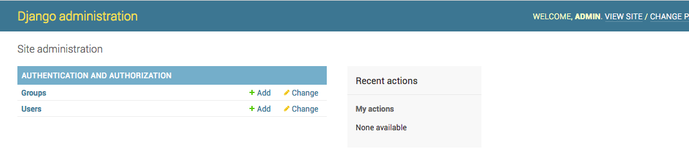使用admin网站创建一个新用户并浏览器中打开http://127.0.0.1:8000/account/login/，你将看到渲染过的包含登录表单的模板：

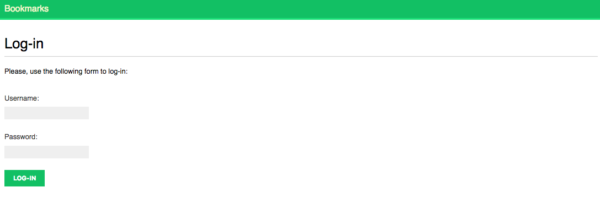

现在，在一个字段为空的情况下提交表单，这种情况下，我们将看到表单无法验证，界面会显示如下错误：

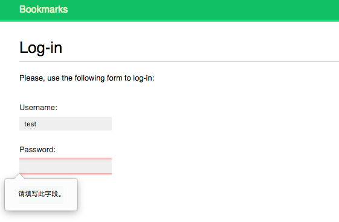

如果你输入了一个不存在的用户或者错误的密码，你将看到一个无效登录错误提示。

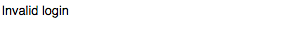

如果输入验证通过，我们将得到一个验证成功的信息：

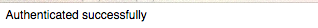

### 使用Django权限视图

Django的权限框架包含几个可以直接使用的表单和视图。我们刚刚创建的登录视图是一个了解Django用户权限系统的很好的例子。然后，我们在大多数情况下可以直接使用Django的权限视图。

Django提供以下视图来处理权限问题：

LoginView：处理登录表单并使用户登录

LogoutView：用户退出登录；

logout_then_login：用户退出登录并重定向到登录页面。

Django提供以下视图来处理更改密码：

PasswordChangeView：处理更改密码表单；

PasswordChangeDoneView：更改密码成功后显示的页面；

DJango提供以下视图来帮助用户重设密码：

PasswordResetView：允许用户重设密码，它将使用token生成一次性链接并发送到用户的e-mail邮箱中。

PasswordResetDoneView：显示重设密码的链接已经发送到用户注册时所用的邮箱中的提示信息。

PasswordResetConfirmView：用户设置新密码；

PasswordResetCompleteView：用户重设密码成功。

> 注意：
>
> 由于Django将废弃函数形式的视图，这里除了logout_then_login之外使用的是类视图。
>
> 这里的邮箱要与用户注册时使用的邮箱一致，否则虽然Django不会报错，但是也不会发送邮件。

创建网站的用户账户时上面的视图可以帮助我们节约很多时间。视图使用可以覆盖的默认值，比如需要渲染的模板的位置或者视图中使用的表单。

我们可以从以下网页得到更多关于内置权限视图的资料https://docs.djangoproject.com/en/1.11/topics/auth/default/#module-django.contrib.auth.views。

### 登录及退出登录视图

 编辑account应用的urls.py文件，并添加以下代码：

```python
from django.conf.urls import url
from django.contrib.auth.views import LoginView, LogoutView, logout_then_login
from . import views

app_name='account'
urlpatterns = [# previous login view
    # url(r'^login/$', views.user_login, name='login'),
    # login / logout urls
    url(r'^login/$', LoginView.as_view(), name='login'),
    url(r'^logout/$', LogoutView.as_view(), name='logout'),
    url(r'^logout_then_login/$', logout_then_login, name='logout_then_login'),
    ]
```

我们注释了之前创建的user_login视图的URL模式，使用Django权限框架的LoginView视图。

在account应用的模板目录下新建一个名为registration的目录。这是Django权限视图模板的默认路径。在目录下新建一个名为login.html的文件，并添加以下内容：

```python


Log-in


  <h1>Log-in</h1>
  
    <p>
      Your username and password didn't match.
      Please try again.
    </p>
  
    <p>Please, use the following form to log-in:</p>
  
  <div class="login-form">
    <form action="" method="post">
      {{ form.as_p }}
      
      <input type="hidden" name="next" value="{{ next }}" />
      <p><input type="submit" value="Log-in"></p>
    </form>
  </div>

```

这个登录模板与我们之前创建的非常类似。Django默认使用django.contrib.auth.forms中的AuthenticationForm。这个表单用于验证用户以及用户登录不成功时引发验证失败错误。在这种情况下，我们可以在模板中使用来检查是否出现验证错误。注意，我们添加了一个隐藏的<input>元素来提交变量next的值。这个变量是login视图获得的request参数（比如：http://127.0.0.1:8000/account/login/?next=/account/）。

next参数是一个URL，如果给定了这个参数，Django 登录视图在登录成功后将重定向到这个URL。

现在，在registration模板目录下新建一个名为logged_out.html的模板并添加以下内容：

```python


Logged out


  <h1>Logged out</h1>
  <p>You have been successfully logged out. You can <a href="">log-in again</a>.</p>

```

这是用户退出登录时显示的模板。

为登录和退出登录添加完URL模式和模板后，我们的网站已经可以使用Django权限系统了。

> 注意：
>
> urlconf中的logout_then_login视图实现退出登录让后重定向到登录页面，因此不需要任何模板。

现在，我们将新建一个视图在用户成功登录时为用户提供公告板。打开account应用的views.py文件并添加以下代码：

```python

from django.contrib.auth.decorators import login_required


@login_required
def dashboard(request):
    return render(request, 'account/dashboard.html', {'section': 'dashboard'})
```

我们使用权限框架的login_required装饰器装饰视图。这个login_required装饰器检查当前用户是否有权限。如果用户有权限，它将执行被装饰的视图；如果用户没有权限，它将重定向到登录URL并且将这个视图的URL作为登录URL的next参数传递给登录视图，这样，当用户成功登录用将重定向到要访问的页面。之前我们在登录模板的表单中添加了一个隐藏输入以实现这个功能。

我们还定义了一个section变量。我们使用这个变量确定用户查看的是网站的哪一部分。许多视图可能对应同一部分，定义每个视图对应的部分是最简单的实现办法。

现在，我们需要为公告板dashboard视图创建一个模板，在templates/account/目录下新建一个名为dashboard的文件，并添加以下代码：

```python


Dashboard


  <h1>Dashboard</h1>
  <p>Welcome to your dashboard.</p>

```

现在，在accounts应用的urls.py文件中添加以下URL模式：

```python
    url(r'^$',views.dashboard,name='dashboard'),
```

编辑项目的settings.py文件并添加以下代码：

```python
from django.core.urlresolvers import reverse_lazy

LOGIN_REDIRECT_URL = reverse_lazy('account:dashboard')
LOGIN_URL = reverse_lazy('account:login')
LOGOUT_URL = reverse_lazy('account:logout')
```

这些设置包括：

- LOGIN_REDIRECT_URL：contrib.auth.views.login视图没有获得next参数时，django登录后重定向的URL。
- LOGIN_URL：重定向登录的URL(比如：使用login_required)
- LOGOUT_URL：重定向退出登录的URL。

我们使用reverse_lazy()通过名称动态创建URL。reverse_lazy()与reverse()功能类似，它们的区别在于reverse_lazy()可以在项目加载URL配置之前使用。

我们总结一下之前所做的工作：

- 在项目中添加了django内置权限登录和退出登录视图；
- 为两个视图创建了自定义模板并定义了一个用户登录后重定向的简单视图；
- 最后，为Django默认使用这些视图的URL进行了配置。

现在，我们通过将登录和退出登录添加到基本模板中来进行集成。

为了在各种情况都能显示正确的链接，我们需要确定当前用户是否处于登录状态。权限中间件将当前用户设置到request对象中。我们可以通过request.user访问它，即使用户没有授权为我们也可以得到request.user对象，request中没有授权的用户为一个AnonymousUser实例。检查当前用户是否授权的最佳办法是调用request.user.is_autherticated()。

编辑base.html中ID为header的<div>元素：

```python
<div id="header">
    <span class="logo">Bookmarks</span>
    
    <ul class="menu">
      <li class="selected">
        <a href="">My dashboard</a>
      </li>
      <li class="selected">
        <a href="#">Images</a>
      </li>
      <li class="selected">
        <a href="#">People</a>
      </li>
    </ul>
  

  <span class="user">
    
      Hello {{ request.user.first_name }},
      <a href="">Logout</a>
    
      <a href="">Log-in</a>
    
  </span>
</div>
```

你可以看到，我们只为授权用户展示网站目录。我们还通过检查section来为对应的<li>元素添加selected类属性以高亮显示当前section。如果用户已经授权，我们还会显示当前用户的名字及退出登录链接；如果用户未授权，我们将显示登录链接。

现在在浏览器中打开http://127.0.0.1:8000/account/login/，应该可以看到登录页面。输入有效的用户名和密码并点击登录按钮，我们应该可以看到：

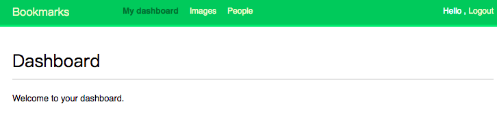


我们可以看到My dashboard一节处于高亮状态，由于它有selected类。由于用户已经授权，所以在header的右侧显示了用户的名字及退出登录链接。点击退出登录链接，你应该可以看到：

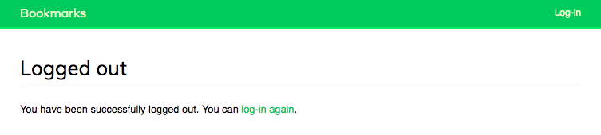

在这个页面中，我们可以看到用户已经退出登录，因此，我们无法看到网站的目录，header右侧的链接也变为了登录。

如果你看到的是django admin网站的退出登录页面，那么请检查项目settings.py中INSTALLED_APPS以确保django.contrib.admin在account应用之后。这两个应用的模板处于相同的相对位置，对于相同相对位置的模板Django将加载第一个找到的模板。

### 更改密码

我们还需要具备用户登陆后可以更改密码的功能。我们将使用Django权限视图来实现更改密码。

打开account应用的views.py文件并添加以下代码：

```python
from django.urls import reverse_lazy
from django.contrib.auth.views import PasswordChangeView

class PasswordChange(PasswordChangeView):
    success_url = reverse_lazy('account:password_change_done')
```

打开account应用的urls.py文件并将其改为：

```python
from django.conf.urls import url
from django.contrib.auth.views import login, logout, logout_then_login
from django.contrib.auth.views import password_change,password_change_done
from django.contrib.auth.views import PasswordChangeDoneView
from . import views

app_name='account'
urlpatterns = [# previous login view
    # url(r'^login/$', views.user_login, name='login'),
    # login / logout urls
    url(r'^$',views.dashboard,name='dashboard'),
    url(r'^login/$', login, name='login'),
    url(r'^logout/$', logout, name='logout'),
    url(r'^password_change/$',views.PasswordChange.as_view(),name='password_change'),
    url(r'^password_change/done/$',PasswordChangeDoneView.as_view(),name='password_change_done'),
    url(r'^logout_then_login/$', logout_then_login, name='logout_then_login'),
    ]
```

> 注意：
>
> 原文使用的是password_change及password_change_done函数，由于auth视图中的函数将被基类函数代替，因此这里使用的是PasswordChangeView和PasswordChangeDone类视图。
>
> 由于django.contrib.auth.views中的success_url = reverse_lazy('password_change_done')报错显示，我们在views.py中使用PasswordChange继承PasswordChangeView并将其success_url更改为reverse_lazy('account:password_change_done')。

PasswordChange视图将处理更改密码表单，PasswordChangeDone将在用户成功更改密码后显示成功消息。我们来为每个视图创建相应的模板。

在account应用的templates/registration/目录下新建名为password_change_form.html的文件。并添加以下代码:

```python


Change you password


  <h1>Change you password</h1>
  <p>Use the form below to change your password.</p>
  <form action="." method="post">
    {{ form.as_p }}
    <p><input type="submit" value="Change"></p>
    
  </form>

```

这个模板包含更改密码的表单。现在，在相同的目录下新建名为password_change_done.html的文件并添加以下代码：

```python


Password changed


  <h1>Password changed</h1>
  <p>Your password has been successfully changed.</p>

```

这个模板只包括成功更改密码后的提示的成功信息。

现在在浏览器中打开http://127.0.0.1:8000/account/password_change/ ，如果用户没有登录，浏览器将重定向的登录页面，当成功授权后，你见看到以下的更改密码页面：

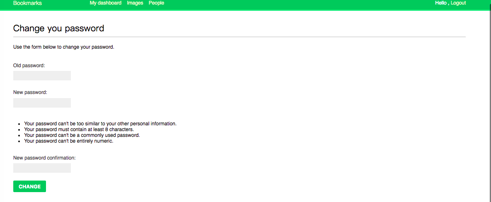

> 注意：New password confirmation之前的列表信息为新密码设置规则，如果不想显示，可以在CSS中设置`.helptext{display:none}`。
>

输入当前密码及新密码并点击Change按钮，你将看到成功页面：

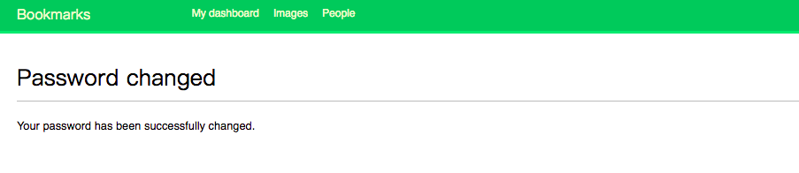

退出登录并使用新密码再次登录以验证更改密码功能。

### 重设密码

在account应用的views.py中添加以下代码:

```python
from django.contrib.auth.views import PasswordResetView,PasswordResetConfirmView


class PasswordReset(PasswordResetView):
    from_email = 'email-username@hotmail.com'
    html_email_template_name = 'registration/password_reset_email.html'
    success_url = reverse_lazy('account:password_reset_done')


class PasswordResetConfirm(PasswordResetConfirmView):
    success_url = reverse_lazy('account:password_reset_complete')
```

> 注意：
>
> 第二章只测试到hotmail邮箱可以正常实现发送邮件，因此这里使用hotmail邮箱。
>
> 这里的email-username@hotmail.com要有后面项目settings.py中设置的EMAIL_HOST_USER的值保持一致。

向account应用添加以下URL模式以实现重设密码：

```python
from django.contrib.auth.views import PasswordResetCompleteView
from django.contrib.auth.views import PasswordResetDoneView

	url(r'^password_reset/$', views.PasswordReset.as_view(),
        name='password_reset'),
    url(r'^password_reset/done/$', PasswordResetDoneView.as_view(),
        name='password_reset_done'),
    url(r'^password_reset/confirm/(?<uidb64>[-\w]+)/(?<token>[-\w]+)/$',
        views.PasswordResetConfirm.as_view(), name='parssword_reset_confirm'),
    url(r'^password_reset/complete/$', PasswordResetCompleteView.as_view(),
        name='password_reset_complete'),
        
```

现在在account应用的templates/registration/目录下新建名为password_reset_form.html文件并添加以下代码：

```html


Reset your password


  <h1>Forgotten your password?</h1>
  <p>Enter your e-mail address to obtain a new password.</p>
  <form action="." method="post">
    {{ form.as_p }}
    <p><input type="submit" value="Send e-mail"></p>
    
  </form>

```

现在，在相同目录下新建名为password_reset_email.html的文件并添加以下代码：

```html
Someone asked for password reset for email {{ email }}. Follow the link below:
{{ protocol }}://{{ domain }}
Your username, in case you've forgotten: {{ user.get_username }}
```

这个模板用于渲染重设密码发送给用户的邮件。

在相同的目录下创建另一个名为password_reset_done.html的文件并添加以下代码：

```html


Reset your password


  <h1>Reset your password</h1>
  <p>We've emailed you instructions for setting your password.</p>
  <p>If you don't receive an email, please make sure you've entered the address you registered with.</p>

```

在相同目录下创建另一个名为password_reset_confirm.html的文件，并添加以下代码：

```html


Reset your password


  <h1>Reset your password</h1>
  
    <p>Please enter your new password twice:</p>
    <form action="." method="post">
      {{ form.as_p }}
      
      <p><input type="submit" value="Change my password" /></p>
    </form>
  
    <p>The password reset link was invalid, possibly because it has already been used. Please request a new password reset.</p>
  

```

我们会检查添加的链接是否有效。Django重设密码视图设置这个变量并将其放入模板的context中。如果链接有效将显示用户密码重设表单。

在相同目录下新建名为password_reset_complete.html的文件并添加以下代码：

```html


Password reset


<h1>Password set</h1>
  <p>Your password has been set. You can <a href="">log in now</a></p>

```

现在，在浏览器中打开http://127.0.0.1:8000/account/login/并点击忘记密码？链接，我们应该看到以下页面：

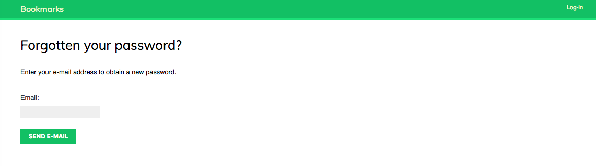


这里，我们需要在项目的settings.py文件中加入SMTP配置以使Django可以发送邮件。我们已经在第二章中学习了如何发送邮件。

```python
# e-mail setting
EMAIL_HOST = 'smtp-mail.outlook.com'
EMAIL_HOST_USER = 'email-username@hotmail.com'
EMAIL_HOST_PASSWORD = 'email-password'
EMAIL_PORT = 587
EMAIL_USE_TLS = True
```

然后，在开发服务器中，我们可以配置Django将e-mail输出到标准输出而不是通过SMTP服务器发送。Django提供一个e-mail后端向console输出e-mail。编辑项目的settings.py文件并添加以下代码：

```python 
EMAIL_BACKEND='django.core.mail.backends.console.EmailBackend'
```

EMAIL_BACKEND用于设置发送邮件所使用的类。

回到浏览器，输入一个用户注册时使用的e-mail地址并点击Send e-mail按钮，我们将看到以下页面：

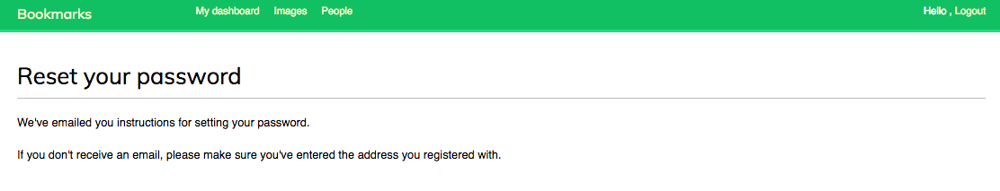

查看一下你运行开发服务器的console，将会看到生成了这样一封邮件：

```
Content-Type: multipart/alternative;
 boundary="===============0507565557010827787=="
MIME-Version: 1.0
Subject: Password reset on 127.0.0.1:8000
From: from_username@hotmail.com
To: to_username@qq.com
Date: Mon, 20 Nov 2017 07:01:54 -0000
Message-ID: <20171120070154.1292.6759@appledemacbook.local>

--===============0507565557010827787==
Content-Type: text/plain; charset="utf-8"
MIME-Version: 1.0
Content-Transfer-Encoding: 7bit

Someone asked for password reset for email to_username@qq.com. Follow the link below:
http://127.0.0.1:8000/account/password_reset/Mg/4rb-b850efa655cc38f792e7/
Your username, in case you've forgotten: testuser
--===============0507565557010827787==
Content-Type: text/html; charset="utf-8"
MIME-Version: 1.0
Content-Transfer-Encoding: 7bit

Someone asked for password reset for email 80884678@qq.com. Follow the link below:
http://127.0.0.1:8000/account/password_reset/Mg/4rb-b850efa655cc38f792e7/
Your username, in case you've forgotten: testuser
--===============0507565557010827787==--
```

e-mail使用我们之前创建的password_reset_email.html模板渲染。

如果去掉之前在settings.py中设置的EMAIL_BACKEND，那么你将在邮箱中收到一封邮件：

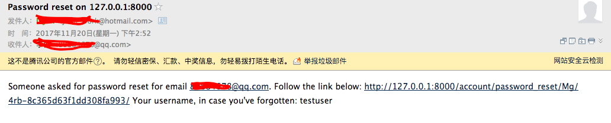

重设密码的URL包含一个Django动态生成的token。在浏览器中打开邮件中的链接，你将看到以下页面：

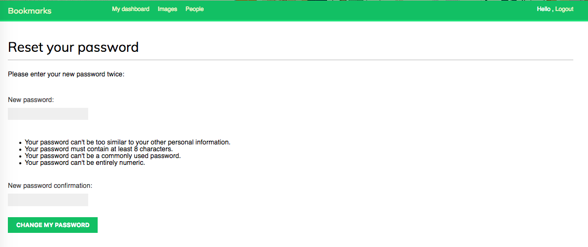

重设密码页面与password_reset_confirm.html对应，输入新的密码并点击Change my password按钮。Django将对密码进行加密并保存到数据库中，你将看到一个成功页面：

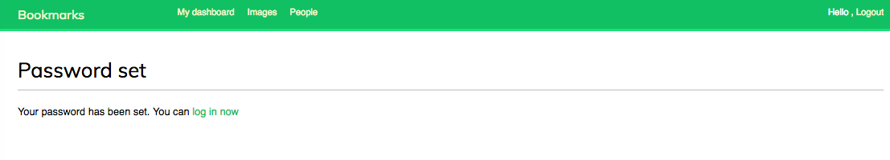

现在，你可以使用新密码重新登录。每个重设密码的token只能使用一次。如果你再次打开链接，你将收到一条token无效的消息。

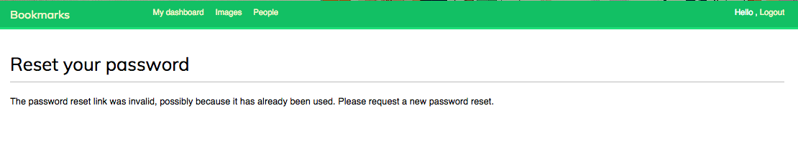

现在，我们已经在项目中集成了Django权限框架视图。这些视图适用于大多数情况。当然，你也可以使用自己的视图实现其他行为。

