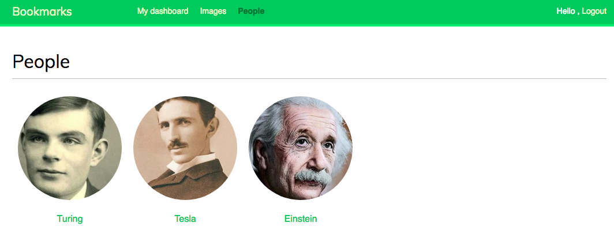
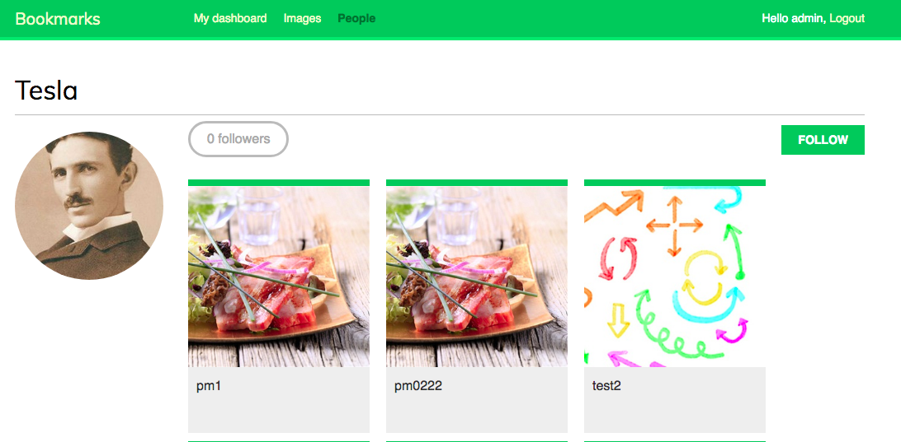
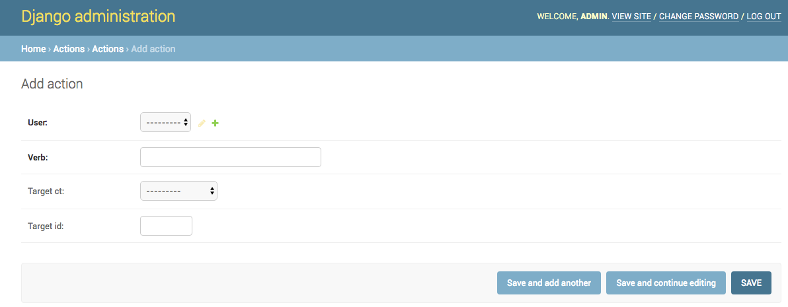
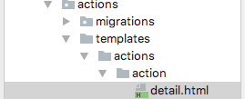
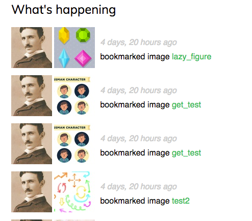
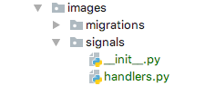
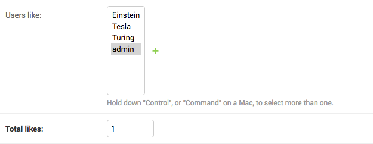
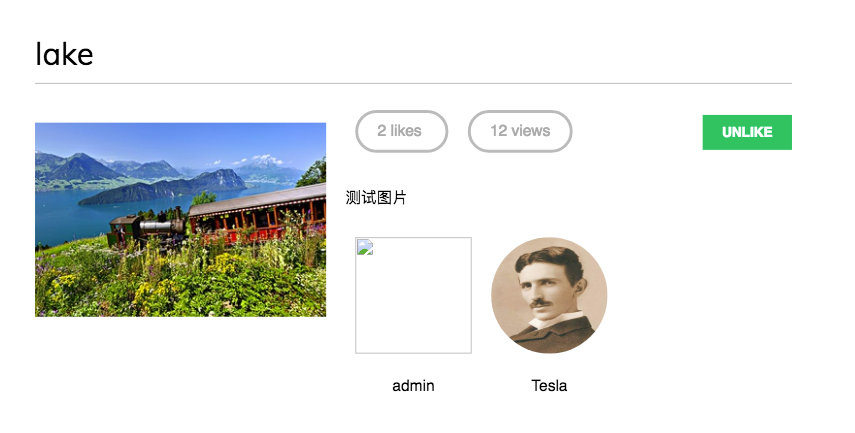
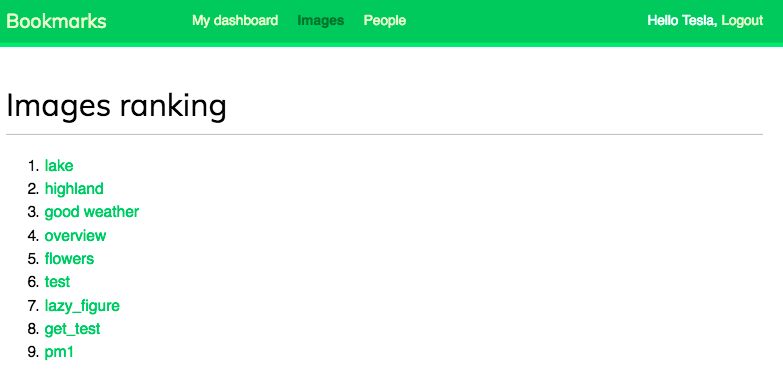

# CH6 关注用户动态

上一章，我们通过 jQuery 为项目添加 AJAX 视图，并创建了 将其它网站的内容分享到自己开发的平台上 JavaScript bookmarklet。

本章，我们将学习如何创建关注系统和用户活动流。我们将了解 Django signal 如何工作，集成 Redis 快速 I/O 存储来保存视图。


本章将包含以下内容：

- 通过中间模型创建多对多关系

- 创建 AJAX 视图

- 创建一个活动流应用

- 为模型添加通用关系

- 为相关对象优化 QuerySets

- 使用 signals 进行非规范化计数

- 在 Redis 中保存视图

  ​


## 创建关注系统


我们将在项目中创建关注系统。我们的用户将能够互相关注并看到其它用户在自己平台上分享的内容。用户之间是多对多关系，一个用户可以关注多个用户也可以被多个用户关注。


### 通过中间模型创建多对多模型


上一章，我们已经使用 ManyToManyField 创建相关模型的多对多关系，这样 Django 将会自动为关系创建数据库模型。这种方法适合大多数情况，但有时我们也需要为关系创建中间模型。中间模型用来为关系添加其它内容（比如关系创建日期或者描述关系类型的字段）。

我们将创建中间模型来建立用户之间的关系。这里创建中间模型的原因有两个：

- 使用 Django 提供的 user 模型保存用户信息，需要尽量避免对其进行更改；

- 需要保存关系创建的时间。


编辑 account 应用的 models.py 文件并添加以下代码：

```python 
from django.contrib.auth.models import User


class Contact(models.Model):
    user_from = models.ForeignKey(User, related_name='rel_from_set')
    user_to = models.ForeignKey(User, related_name='rel_to_set')
    created = models.DateTimeField(auto_now_add=True, db_index=True)

    class Meta:
        ordering = ('-created',)

    def __str__(self):
        return '{} flollows {}'.format(self.user_from, self.user_to)

```

这是表示用户关系的 Contact 模型。它包含以下字段：

- user_from: 表示创建关系用户的 ForeignKey ；
- user_to: 表示被关注用户的 ForeignKey ；
- created:  auto_now_add 设置为 True 的 DateTimeField 字段，用于保存关系创建的时间。

ForeignKey 字段将自动创建数据库索引。这里使用 db_index=True 为 created 字段创建索引。如果 QuerySets 使用该字段进行排序，创建索引将提高查询效率。

通过ORM，我们可以创建 user1 关注其它用户 user2 的关系：

```python
user1 = User.objects.get(id=1)
user2 = User.objects.get(id=2)
Contact.objects.create(user_from=user1, user_to=user2)
```

相关管理器 rel_from_set 和 rel_to_set 将为 Contact 模型返回 queryset 。我们可以在 User 模型中增加下面的 ManyToManyField 字段来访问关系的另一端：

```python
following = models.ManyToManyField('self',through=Contact,related_name='followers',symmetrical=False)
```

上面的代码中，我们为 ManyToManyField 设置 through=Contact 来告诉 Django 使用自定义中间模型 Contact 。这是一个 User 模型本身的多对多关系；通过 ManyToManyField 指向  self  来向相同模型创建关系。

> 注意：
>
> 如果需要在多对多关系中添加额外字段，那么请创建一个包含关系两端 ForeignKey 的自定义模型，并在相关模型的一个模型中添加一个 ManyToManyField 并通过 through 参数设置中间模型。


如果 User 模型是应用的一部分，我们可以向模型添加上面的字段。然而， User 模型属于 django.contrib.auth ，我们不能直接对其进行更改。这里我们动态向 User 模型添加字段，编辑 accounts 应用的 models.py 文件并添加以下内容：

```python
# Add following field to User dynamically
User.add_to_class('following', models.ManyToManyField('self', through=Contact,
                                                      related_name='followers',
                                                      symmetrical=False))
```

上面的代码使用 Django 模型的 add_to_class() 方法来对 User 模型打补丁( monkey-patch) 。Django 并不推荐使用add_to_class() 为模型添加字段，我们在这里使用它们的原因为：

- 通过 user.followers.all() 和 user.followering.all() 简化了获取相关对象的方法。就像我们在自定义模型 Profile 中定义关系一样 ，这里使用中间模型 Contact 来避免进行额外连接的复杂查询。

- 多对多关系的数据库表将通过 Contact 模型进行创建。这样动态添加 ManyToManyField 不会对 User 模型产生影响。

- 避免创建自定义用户模型，保持了 Django 内置 User 模型的所有优势。


 在大多数情况下，与其对 User 模型打补丁（monkey-patching），不如使用之前创建的 Profile 模型添加字段。Django还允许使用自定义用户模型，如果想要使用自定义用户模型，参考文档https://docs.djangoproject.com/en/1.11/topics/auth/customizing/#specifying-a-custom-user-model。

向模型本身定义 ManyToManyField 时我们设置了symmetric=False，Django 将强制关系对称，在这种情况下，我们设置 symmetric=False 来定义非对称关系。也就是说，我关注你并不意味着你自动关注我。


> 注意：
>
> 使用中间模型创建多对多关系时 ，add() 、create() 或 remove() 等相关管理方法失效。对中间模型进行操作需要创建或者删除中间模型实例。


运行以下命令生成 account 应用的迁移文件：

```python
python manage.py makemigrations account	
```

你将看到下面的输出：

```python
Migrations for 'account':
  account/migrations/0002_contact.py

 - Create model Contact
```

现在，运行以下命令同步数据库：

```python
python manage.py migrate account
```

你将看到下面的输出：

```python
  Applying account.0002_contact... OK
```

Contact 模型现在已经同步到数据库了，我们可以在用户之间创建关系了。然而，我们的网站现在还不支持浏览用户或查看用户资料的功能。下面我们将为 User 模型创建列表和详情视图。


### 为用户创建列表和详情视图


打开 account 应用的 views.py 文件并添加以下代码：

```python 
from django.shortcuts import get_object_or_404
from django.contrib.auth.models import User


@login_required
def user_list(request):
    users = User.objects.filter(is_active=True, is_superuser=False)
    return render(request, 'account/user/list.html',
                  {'section': 'people', 'users': users})


@login_required
def user_detail(request, username):
    user = get_object_or_404(User, username=username, is_active=True)
    return render(request, 'account/user/detail.html',
                  {'section': 'people', 'user': user})
```

这是 User 对象的简单列表和详情视图。 user_list 视图获取所有处于活跃状态的用户。Django User 模型包含 is_active 字段，该字段用来判断用户是否处于活跃状态。我们通过 `is_active = True` 返回处于活跃状态的用户。这个视图将返回所有的结果，我们可以采用 image_list 视图的办法对结果进行分页处理。

> 与原文的区别：
>
> 定义user_list 的 user 时，我们通过增加设置`is_superuser=False`返回处于活跃状态且不是超级用户的用户。

user_detail 视图使用 get_object_or_404() 快捷函数来获得给定用户名的活跃用户。如果没有找到符合给定用户名的活跃用户，视图将返回 HTTP 404 。

编辑 account 应用的 urls.py 文件为每个视图添加 URL模式：

```python 
url(r'^users/$', views.user_list, name='user_list'),
url(r'^users/(?P<username>[-\w]+)/$', views.user_detail,
    name='user_detail'),
```

我们将使用 user_detail URL模式为用户生成标准链接。我们在模型中定义了一个 get_absolute_url() 方法为每个对象返回标准链接。另一种指定模型 URL 的方法是在项目 settings.py 中设置 ABSOLUTE_URL_OVERRIDES 。

编辑项目的 settings.py 文件并添加以下代码：

```python 
ABSOLUTE_URL_OVERRIDES = {
    'auth.user': lambda u: reverse_lazy('account:user_detail', args=[u.username])}
```

django 为 ABSOLUTE_URL_OVERRIDES 设置的所有模型动态添加 get_absolute_url() 方法。这个方法为设置中的指定模型返回相应的 URL 。我们为特定用户返回 user_detail URL。现在可以通过 User 实例的 get_absolute_url() 获取对应的URL。使用python manage.py shell 打开Python shell 并运行以下代码进行测试：

```python
In [1]: from django.contrib.auth.models import User

In [2]: user = User.objects.latest('id')

In [3]: str(user.get_absolute_url())
Out[3]: '/account/users/admin/'
```

输出返回了我们期待的 URL。然后需要为刚刚创建的视图添加模板，在 account 应用的 templates/account/ 目录下添加以下路径：

```python



People


    <h1>People</h1>
    <div id="people-list">
        
            <div class="user">
                <a href="{{ user.get_absolute_url }}">
                    {% thumbnail user.profile.photo "180x180" crop="100%" as im %}
                        
                    
                </a>
                <div class="info">
                    <a href="{{ user.get_absolute_url }}" class="title">
                        {{ user.username }}
                    </a>
                </div>
            </div>
        
        </div>

```

这个模板可以列出网站上所有处于活跃状态的人，对给定的 user 进行迭代并使用 sorl-thumbnail 的 （% thumbnail %} 模板标签生成用户头像的缩略图。


打开项目的基础模板 base.html 并为目录 People 的 href 属性添加 user_list 链接：

```HTML
<li class="selected">
    <a href="">People</a>
</li>
```

使用 python manage.py runserver 命令启动开发服务器并在浏览器中打开 http://127.0.0.1:8000/account/users/，我们将看到下面的用户列表：



> 与原文的区别：
>
> 显示上述页面，我们需要为 Users 模型添加上面三个用户，并且在 Profiles 模型中添加上面三个用户并设置他们的图片。我们可以使用 admin 网站很快完成上述添加。


编辑 account 应用的 account/user/detail.html 模板并添加以下代码：

```python



{{ user.username }}


    <h1>{{ user.username }}</h1>
    <div class="profile-info">
        {% thumbnail user.profile.photo "180x180" crop="100%" as im %}
            
        
    </div>
    
        <span class="count">
      <span class="total">{{ total_followers }}</span>
      follower{{ total_followers|pluralize }}
    </span>
        <a href="#" data-id="{{ user.id }}"
           data-action="unfollow"
           class="follow button">
            
                Follow
            
                Unfollow
            
        </a>
        <div id="image-list" class="image-container">
            
        </div>
    

```

> 与原文的区别：
>
> 这里将文中  和 <h1> 元素中user.get_full_name改为了user.username。
>
> user.get_full_name 会组合user的first_name字段和last_name字段获得用户名，而在设置时未填写这两个字段，因此进行了修改。

在细节模板中，我们展示了用户资料并使用  模板标签来展示资料图片。可以显示关注的人数和关注/取消关注的链接。如果用户查看自己的资料则隐藏该链接以防止用户关注自己。我们将使用一个 AJAX 请求来关注/取消关注特定用户。为 HTML 的 <a> 元素添加 data-id 和 data-action 属性；来保存用户ID和点击时的初始属性、关注或取消关注，这些属性取决于请求页面的用户是否已被该用户关注。我们通过 list_ajax.html 模板展示用户标记的图片。

再次打开浏览器并点击一个已经标记一些图片的用户。你将看到下面这样的资料详情。




### 创建 AJAX视图来关注用户动态

我们将使用 AJAX 创建一个简单的视图来实现关注/取消关注用户。编辑 account 应用的 views.py 文件并添加以下代码：

```python
from django.http import JsonResponse
from django.views.decorators.http import require_POST
from common.decorators import ajax_required
from .models import Contact
from django.db import models


@ajax_required
@require_POST
@login_required
def user_follow(request):
    user_id = request.POST.get('id')
    action = request.POST.get('action')
    if user_id and action:
        try:
            user = User.objects.get(id=user_id)
            if action == 'follow':
                Contact.objects.get_or_create(user_from=request.user,
                                              user_to=user)
            else:
                Contact.objects.filter(user_from=request.user,
                                       user_to=user).delete()
            return JsonResponse({'status': 'ok'})
        except models.ObjectDoesNotExist:
            return JsonResponse({'status': 'ko'})
    return JsonResponse({'status': 'ko'})
```

我们创建的 user_follow 视图与之前创建的 image_like视图类似。由于我们已经使用了表示多对多关系的自定义中间模型，因此不能再使用 ManyToManyField 管理器的默认 add() 和 remove() 方法。所以，我们使用中间模型 Contact 模型来创建或删除用户关系。

在 account 应用的 urls.py 文件中添加以下 URL模式：

```python
url(r'^users/follow/$', views.user_follow, name='user_follow')
```

这个 URL 要放在 user_detail URL之前。否则，任何 /user/follow/ 请求都将匹配user_detail 模式然后执行。获得任何请求时Django都将检查所有URL模式直到遇到第一个匹配的模式然后停止。

编辑account 应用的 user/detail.html 模板并在最后添加以下代码：

```python

  $('a.follow').click(function(e){
    e.preventDefault();
    $.post('',
      {
        id: $(this).data('id'),
        action: $(this).data('action')
      },
      function(data){
        if (data['status'] == 'ok') {
          var previous_action = $('a.follow').data('action');

          // toggle data-action
          $('a.follow').data('action',
            previous_action == 'follow' ? 'unfollow' : 'follow');
          // toggle link text
          $('a.follow').text(
            previous_action == 'follow' ? 'Unfollow' : 'Follow');

          // update total followers
          var previous_followers = parseInt(
            $('span.count .total').text());
          $('span.count .total').text(previous_action == 'follow' ? previous_followers + 1 : previous_followers - 1);
        }
      }
    );
  });

```

> 与原文的区别：
>
> 原文的`$.post(''`运行时报url解析错误，这里改为了 `$.post(''`。

这是实现关注/取消关注特定用户并切换关注/取消关注的 AJAX请求的 JavaScript代码。我们使用 jQuery 实现 AJAX 请求并基于以前的值设置 HTML <a> 元素的 data-action 属性和文本。实现 AJAX 动作时，我们还会更新页面展示的所有关注用户的数量。打开一个已经存在的用户的详情页面并点击 Follow 链接来测试我们刚刚实现的功能。


## 创建通用活动流应用

许多社交网站为用户活动流，以便用户查看其他用户的新活动。活动流表示一个用户或者一组用户最近的活动列表。比如，Facebook 的 News Feed 就是一个活动流。活动可以包括用户 X 标记了图片 Y 或者用户 X 关注了用户 Y。我们将创建活动流应用来帮助用户看到他所关注的用户最近的活动。为了实现这项功能，我们将需要一个模型来保存用户在网站上的活动，以及向 feed 添加活动。

使用以下命令在项目中添加一个名为 actions 的新应用：

```python
python manage.py startapp actions
```

在项目的 settings.py 的 INSTALLED_APPS 添加 actions 来告诉 Django 激活一个新应用：

```python 
INSTALLED_APPS = [...,'actions']
```

编辑 actions 应用的 models.py 文件并添加以下代码：

```python 
# -*- coding: utf-8 -*-
from __future__ import unicode_literals

from django.contrib.auth.models import User
from django.db import models


# Create your models here.
class Action(models.Model):
    user = models.ForeignKey(User, related_name='actions', db_index=True)
    verb = models.CharField(max_length=255)
    created = models.DateTimeField(auto_now_add=True, db_index=True)

    class Meta:
        ordering = ('-created',)
```

这是用于保存用户活动的 Action 模型，该模型的字段包括：

- user：活动的用户。它是  User 模型的外键；

- verb：用户的活动。

- created: 创建活动的日期和时间。这里使用 auto_now_add=True 将该字段的值自动设置为实例的第一次保存时间。


这个基本的模型只能保存用户 X 做了什么的活动。我们还需要一个 ForeignKey 来保存 target 对象，比如用户 X 标记了图片 Y 或者用户 X 关注了用户 Y 。我们已经知道，一个 ForeignKey 只能指向一个其它模型。因此，我们需要一种方法来实现 target 对象可以指向任何存在的模型的实例。Django contenttypes 框架可以实现该功能。

### 使用 contenttypes 框架

Django 的 contenttypes 框架位于 django.contirb.contenttypes 。这个应用可以追踪项目安装的所有模型并提供通用接口来实现模型交互。

我们使用 startproject 命令创建新项目时 INSTALLED_APPS 默认包含 django.contirb.contenttypes  。其它 contrib 模块（如权限框架、admin应用）会用到它。

contenttypes 应用包含一个 ContentType 模型。这个模型的实例表示应用的一个模型。新模型添加到项目时将会自动创建 ContentType 实例。ContentType 将有以下字段：

- app_label ：模型所属的应用名称。它将自动获取模型 Meta 选项 app_label 属性的值。例如，Image模型属于 images 应用。
- model：模型类的名称。
- name：模型的人性化名称。它将自动使用 Meta 选项的 verbose_name 属性的值。

我们来看下如何与 ContentType 对象交互。使用 python manage.py shell 命令打开 Python 终端。我们通过设置  query 的 app_label 和 model 属性来获得指定模型的 ContentType 对象，例如：

```python 
In [2]: from django.contrib.contenttypes.models import ContentType

In [3]: image_type = ContentType.objects.get(app_label='images',model='image')

In [4]: image_type
Out[4]: <ContentType: image>
```

模型类可以通过调用 model_class() 方法从 ContentType 对象获得：

```python
In [5]: image_type.model_class()
Out[5]: images.models.Image
```

还可以获得指定模型类的 ContentType 对象：

```python
In [6]: from images.models import Image

In [7]: ContentType.objects.get_for_model(Image)
Out[7]: <ContentType: image>
```

这里只是 contenttypes 的部分列子。Django 为其提供了很多方法。可以通过以下网页找到 contenttypes 的官方文档：https://docs.djangoproject.com/en/1.11/ref/contrib/contenttypes/。


### 为模型添加通用关系


 ContentType 对象在通用关系中指向关系使用的模型。设置通用关系需要在模型中设置三个字段：

- 指向 ContentType 的 ForeignKey 。它将告诉我们关系使用的模型。
- 保存相关对象主键的字段。 我们通常使用 PositiveIntegerField 来匹配 Django 的自动主键字段。
- 上面两个字段构成的通用关系的定义和管理字段。contenttypes 框架提供一个 GenericForeignKey 字段来实现该功能。

编辑 actions 应用的 models.py 文件：

```python
# -*- coding: utf-8 -*-
from __future__ import unicode_literals

from django.contrib.auth.models import User
from django.contrib.contenttypes.fields import GenericForeignKey
from django.contrib.contenttypes.models import ContentType
from django.db import models


# Create your models here.
class Action(models.Model):
    user = models.ForeignKey(User, related_name='actions', db_index=True)
    verb = models.CharField(max_length=255)
    target_ct = models.ForeignKey(ContentType, blank=True, null=True,
                                  related_name='target_obj')
    target_id = models.PositiveIntegerField(null=True, blank=True,
                                            db_index=True)
    target = GenericForeignKey('target_ct', 'target_id')
    
    created = models.DateTimeField(auto_now_add=True, db_index=True)

    class Meta:
        ordering = ('-created',)
```

我们向 Action 模型添加了以下字段：

- target_ct：指向 ContentType 模型的 ForeignKey。
- target_id: 保存相关对象主键的 PositiveIntegerField。
- target: 基于上面两个字段组合的相关对象。

Django 不会在数据库中创建 GenericForeignKey 字段。能够映射到数据库的字段只有 target_ct 和 target_id。两个字段都设置了 blank=True 和 null=True 以保证在没有设置这两个字段的情况下可以保存Action对象。

> 注意：
>
> 在可以使用通用关系的情况下，使用通用关系比使用外键可以使应用更加灵活。

运行以下命令来为应用创建初始迁移文件：

```python 
python manage.py makemigrations actions
```

可以看到下面的输出：

```python
Migrations for 'actions':
  actions/migrations/0001_initial.py
    - Create model Action
```

然后，运行下面的命令来同步到数据库：

```python
python manage.py migrate
```

下面的输出表示完成了同步：

```python
Operations to perform:
  Apply all migrations: account, actions, admin, auth, contenttypes, images, sessions, social_django, thumbnail
Running migrations:
  Applying actions.0001_initial... OK
```

我们向 admin 网站添加 Action 模型。编辑 actions 应用的 admin.py 文件添加以下代码:

```python 
# -*- coding: utf-8 -*-
from __future__ import unicode_literals

from django.contrib import admin

from .models import Action


# Register your models here.
class ActionAdmin(admin.ModelAdmin):
    list_display = ('user', 'verb', 'target', 'created')
    list_filter = ('created')
    search_fields = ('verb',)


admin.site.register(Action, ActionAdmin)
```

我们刚刚在admin 网站注册了 Action 模型。运行python mange.py runserver 启动开发服务器并在浏览器中打开http://127.0.0.1:8000/admin/actions/action/add。你将看到创建新的 Action 对象的页面:




我们可以看到，这里只显示了映射到数据库的 target_ct 和 target_id 字段，但是没有显示 GenericForeignKey 字段。 target_ct 可以是项目中注册的任何模型，可以通过向 ForeignKey 添加 limit_choices_to 属性来限制可以选择的模型：limit_choices_to 帮助我们将 ForeignKey 字段的内容限定为一组特定的值。

在 actions 应用目录下新建名为 utils.py 的文件。我们将定义新建 Action 对象的快捷函数，添加以下代码：

```python
from .models import Action


def create_action(user, verb, target=None):
    action = Action(user=user, verb=verb, target=target)
    action.save()

```

create_action() 帮助我们创建包含或者不包含 target 对象的action。我们可以在代码的任何位置使用这个函数来向活动流添加新的活动。


### 避免活动流中的重复动作


有时候可能会多次重复某些动作。用户可能在很短时间内多次点击 like/ unlike 按钮或者进行相同的操作。这可能导致保存和展示重复动作。为了避免这种情况，我们需要改进 create_action() 函数来避免大多数重复动作。

编辑 accounts 应用的 utils.py 文件并更改为：

```python
import datetime

from django.contrib.contenttypes.models import ContentType
from django.utils import timezone

from .models import Action


def create_action(user, verb, target=None):
    # check for any similar action made in the last minute
    now = timezone.now()
    last_minute = now - datetime.timedelta(seconds=60)
    similar_actions = Action.objects.filter(user_id=user.id, verb=verb,
                                            timestamp_gte=last_minute)
    if target:
        target_ct = ContentType.objects.get_for_model(target)
        similar_actions = similar_actions.filter(target_ct=target_ct,
                                                 target_id=target.id)
    if not similar_actions:
        action = Action(user=user, verb=verb, target=target)
        action.save()
        return True
    return False

```

我们更改了create_action() 函数来避免重复动作并返回动作是否保存的布尔值。我们是这样避免重复动作的：

- 首先，使用 Django 提供的 timezone.now() 获得当前时间，这个方法与datetime.datetime.now() 并不完全相同，它返回一个 timezone-aware 对象。Django 提供 USE_TZ 设置来使用/禁用时区。startproject 命令生成的 settings.py 文件默认设置 USE_TZ = True。

- 使用 last_minute 变量保存前面一分钟的时刻并获取用户前面一分钟至今的所有动作。

- 如果前面一分钟没有任何动作则创建动作。如果创建了 Action 对象则返回True，否则返回False。


### 向活动流添加用户动态


现在要向视图添加一些动作来创建活动流。我们将保存以下类型的交互动作：

- 用户标记一张图片；

- 用户喜欢/取消喜欢 一张图片；

- 用户创建一个账户；

- 用户关注/取消关注另一个用户；


编辑 image 应用的 的views.py 文件并添加以下内容：

```python 
from actions.utils import create_action
```

在 image_create 视图中的保存图像之后添加 create_action() :

```python 
new_item.save()
create_action(request.user, 'bookmarked image', new_item)
```

在 image_like 视图中，处理完用户喜欢/取消喜欢操作后添加 create_action() 动作：

```python
if action == 'like':
    image.users_like.add(request.user)

else:
    image.users_like.remove(request.user)
create_action(request.user, action, image)
```

现在，编辑 account 应用的 views.py 视图并添加以下内容：

```python
from actions.utils import create_action
```

在 register 视图中的 Profile 对象之后添加 create_action：

```python
new_user.save()
profile = Profile.objects.create(user=new_user)
create_action(new_user,'has created an account')
```

在 user_follow 视图中添加 create_action:

```python 
if action == 'follow':
    Contact.objects.get_or_create(user_from=request.user,
                                  user_to=user)
else:
    Contact.objects.filter(user_from=request.user,
                           user_to=user).delete()
create_action(request.user,action,user)
```

我们可以看到，通过 Action 模型的create_action函数，很容易为活动流保存新的活动。


### 展示活动流


最终，我们需要向每位用户展示活动流，我们将在用户公告板中进行展示。编辑 account 应用的 views.py 文件，导入 Action 模型并更改 dashboard 视图：

```python
from actions.models import Action


@login_required
def dashboard(request):
    # Diasplay all actions by default
    actions = Action.objects.exclude(user=request.user)
    following_ids = request.user.following.values_list('id', flat=True)
    if following_ids:
        # if user is following others, retrieve only their actions 
        actions = actions.filter(user_id__in=following_ids)
    actions = actions[:10]
    return render(request, 'account/dashboard.html',
                  {'section': 'dashboard', 'actions': actions})
```

在这个视图中，我们从数据库获取除了当前用户动作的所有动作。如果用户没有关注任何人，我们展示其他用户的最近活动。如果用户关注了其他用户，我们将活动的用户限制到该用户关注的用户。最后我们将返回的活动限制为 10 条。我们这里不使用 order_by() 是由于我们基于 Action 模型的 Meta 选项设置的 ordering 。由于我们在 Action 模型中设置了 ordering = ('-created',)，我们首先获得的是最近的活动。


### 优化相关对象的QuerySets


每次获取 Action 对象，我们都可能访问相关的 User 对象，甚至还会访问相关的 Profile 对象。 Django ORM 提供一个简单的方法一次性获得相关对象，以避免对数据库的额外访问。

**使用 select_related**

Django 提供一个名为 select_related() 的 query 方法来实现获取一对多关系的相关对象。这将转化为一个更加复杂的 QuerySet ，但是可以避免访问相关对象时的额外查询。select_related 方法也可用于 ForeignKey 和 OneToOne 字段。它通过 SQL 的 JOIN 实现并且包含 Select 中的相关对象。

编辑前面的代码来使用 select_related()：

```python
actions = actions.filter(user_id__in=following_ids)
```

添加你要使用的字段：

```python
actions = actions.filter(user_id_in=following_ids).select_related(
    'user', 'user__profile')
```

我们使用 `user__profile` 在一个SQL 查询中连接 profile 表。如果在不传入任何参数的情况下调用 `select_related`，它将获得所有外键的对象。因此一定要将 select_related限制到前面访问的关系中。

> 注意：
>
> 小心使用select_related可以大大降低查询时间。
>


**使用 prefetch_related**

我们已经看到，select_related()  将帮助我们在一对多关系中获得相关对象。然而 select_related()  不能用于多对多或者多对一关系（ ManyToMany 或反向 ForeignKey 字段）。除了select_related()，Django 还为多对多或者多对一关系提供了 prefetch_related()  方法。 prefetch_related() 方法为每个关系实现单独的查询并使用Python对结果进行连接。这个方法也适用于 GenericRelation 和 GenericForeignKey。

通过添加 prefetch_related()  获得目标 GenericForeignKey 来完成查询：

```python 
actions = actions.filter(user_id_in=following_ids).select_related(
    'user', 'user__profile').prefetch_related('target')
```

现在，已经对获得用户动作及相关对象的查询进行了优化。


### 为动作添加模板

我们将创建模板来展示特定 Action 对象。在 actions 应用下新建一个名为 templates 的目录，并添加以下文件结构：



编辑 actions/action/detail.html 模板文件并添加以下内容：

```HTML



    <div class="action">
        <div class="images">
            
                {% thumbnail user.profile.photo "80x80" crop="100%" as im %}
                    <a href="{{ user.get_absolute_url }}">
                        
                    </a>
                
            

            
                
                    
                        {% thumbnail target.image "80x80" crop="100%" as im %}
                            <a href="{{ target.get_absolute_url }}">
                                
                            </a>
                        
                    
                
            
        </div>
        <div class="info">
            <p>
                <span class="date">{{ action.created|timesince }} ago</span>
                <br/>
                <a href="{{ user.get_absolute_url }}">
                    {{ user.first_name }}
                </a>
                {{ action.verb }}
                
                    
                        <a href="{{ target.get_absolute_url }}">{{ target }}</a>
                    
                
            </p>
        </div>
    </div>

```

这是展示 Action 对象的模板。我们使用 模板标签来获得用户的动作和资料。然后，如果 Action 对象有相关目标对象，我们将展示目标对象的 图片。最后，如果有活动用户，我们将展示活动用户的连接以及它们的动作、目标对象。

现在，编辑 account/dashboard.html 模板并在 content 块的底部添加以下代码：

```python
<h2>What's happening</h2>
<div id="action-list">
    
        
    
</div>
```

现在，在浏览器中打开http://127.0.0.1:8000/account/。使用已存在的用户登录并进行几次操作一遍保存到数据库中。然后，使用另一个用户登录，关注之前的用户，查看一下公告板页面生成的活动流。它应该是这样的：




我们刚刚为用户创建了一个完整的活动流，我们还可以轻松的添加新的用户动作。还可以通过使用之前为 image_list 视图实现的 AJAX 分页来为活动流添加有限滚动效果。


## 使用 signals 进行非规范化计数


有时我们需要不规范的数据。非规范化通过数据冗余来优化读取性能。但是我们只能在必要场合非常小心的进行非规划化。非规范化最大的问题在于很难更新不规范的数据。

我们将看到一个通过非规范化计数改善查询性能的例子。它的缺陷在于我们必须持续更新冗余数据。我们将对Image 模型的数据进行非规范化并通过 Django 的 signals 来维持数据更新。

### 使用signals

Django 提供 signal 适配器来实现一些动作发生时通知某些 receiver 函数的功能。signal 适用于每次进行每个动作后都要进行某些其他动作的情况 。你可以创建自己的 signal 以便于一个事件发生后其它事件可以得到通知。

Django 在 django.db.models.signals 中为模型提供几个 signal。其中的一些 signal 包括：

-  pre_save 和 post_save：调用模型 save() 方法之前或之后发送；
-  pre_delete 和 post_delete：调用模型或queryset的 delete() 方法之前或之后发送；
-  m2m_changed: 模型的ManyToManyField 改变时发送；

这些只是 django 提供的 signal 的一部分，django 的内置 signal 列表见https://docs.djangoproject.com/en/1.11/ref/signals/。

如果想通过受欢迎程度来检索图片。我们可以使用 Django 集合函数获得喜欢图片的人数来进行排序。我们在第三章已经使用过聚合函数。下面的代码将通过喜欢的数量获得图像:

```python
from django.db.models import Count
from images.models import Image

image_by_popularity = Image.objects.annotate(total_likes=Count('users_like')).order_by('-total_likes')
```

然而，通过对所有的 likes 计数进行排序比通过保存总数的字段进行排序浪费更多的资源。 我们可以为 Image 模型添加一个字段来对 likes 进行非规范化计数来增强查询该字段的性能。那么应该何更新该字段呢？

编辑images 应用的models.py 文件，为 Image模型添加以下字段：

```python 
total_likes = models.PositiveIntegerField(db_index=True,default=0)
```

total_likes 字段将帮助我们存储喜欢每幅图片的总人数。如果需要根据该字段进行排序或者过滤，那么非规范化数据非常有用。

> 注意:
>
> 在设置非规范化字段之前可以考虑其它几种方法改善性能：设置数据索引、查询优化、缓存等。
>

运行以下命令来创建新增加字段的迁移：

```python 
python manage.py makemigrations images
```

你应该可以看到下面的输出:

```python
Migrations for 'images':
  images/migrations/0002_image_total_likes.py
    - Add field total_likes to image
```

然后运行以下命令实现迁移:

```python
python manage.py migrate images
```

输出应该包含以下内容：

```python 
Operations to perform:
  Apply all migrations: account, actions, admin, auth, contenttypes, images, sessions, social_django, thumbnail
Running migrations:
  Applying images.0002_image_total_likes... OK
```

我们将为m2m_changed signal添加一个 receiver 函数。在images 应用目录下增加如下图所示的结构。




> 与原文的区别:
>
> signals 官方用户手册中建议为了最小化导入代码的副作用，建议不要将 signal 放在应用的根目录或者 models 模块中，因此这里根据建议增加了 signals 子模块。
>
> 具体参考：https://docs.djangoproject.com/en/1.11/topics/signals/#defining-and-sending-signals

向 handlers.py 中添加以下代码：

```python
from django.db.models.signals import m2m_changed
from django.dispatch import receiver

from images.models import Image


@receiver(m2m_changed, sender=Image.users_like.through)
def user_like_changed(sender, instance, **kwargs):
    instance.total_likes = instance.users_like.count()
    instance.save()

```


首先，我们使用 receiver() 装饰器将 users_like_changed 函数注册为 receiver 函数。我们将函数连接到 Image.users_like.through 以便于只有发送 m2m_changed signal 时才调用该函数。我们还可以使用另外一种方法来注册 receiver 函数，该方法与 使用 Signal 对象的 connect() 方法一致。

users_like_changed 的输入：

| `sender`   | ` Image.users_like.through` (内部多对多关系模型类) |
| ---------- | ---------------------------------------- |
| `instance` | 要修改的 `Image` 实例                          |

> 注意:
>
> django signals 是同步阻塞的。不要将signals 与 异步任务混为一谈。然而，当你的代码收到signal通知后可以结合使用异步任务。

你可以将一个接收函数连接到 signal ，这样可以在每次发送 signal 之后调用该函数。注册 signal 的推荐方法为在你应用配置类的 ready() 方法中进行导入。Django 提供了一个应用程序注册表，允许您配置和检查应用程序。

 

### 定义应用配置

**classes**

Django允许用户指定应用配置类。创建一个继承 django.apps 中 AppConfig 类的自定义类来为应用提供自定义配置。应用配置类允许用户存储 metadata 和应用配置以及实现检查功能。

关于应用配置的更多信息见https://docs.djangoproject.com/en/1.11/ref/applications/。

注册 signal receiver 函数（使用 receiver() 装饰器），只需在 AppConfig 类的 ready() 方法中导入 应用的 signal模块。应用注册时会调用 ready() 方法。应用的其他初始化也应该放在这个方法中。

在images 应用目录下的apps.py 文件中将源代码更改为：

```python
# -*- coding: utf-8 -*-
from __future__ import unicode_literals

from django.apps import AppConfig


class ImagesConfig(AppConfig):
    name = 'images'
    verbose_name = 'Image bookmarks'

    def ready(self):
        # import signal handler
        import signals.handlers
```

> 与原文的区别：
>
> 原文需要新建apps.py 文件，在django1.11版本中项目初始化会自动生成apps.py 文件，只需对其进行更改即可。

name 属性定义了应用的 Python 路径，verbose_name 为应用设置了人性化名称，它将会显示在 admin 网站中。ready() 方法为应用导入 signals。

现在，我们需要告诉 django 使用的应用配置类，编辑images 应用目录的`__init__`函数并添加以下内容:

```python 
default_app_config = 'images.apps.ImagesConfig'
```

打开浏览器查看图像细节页面并点击like按钮。回到admin网站并看一下total_likes 属性。你应该可以看到total_likes 属性进行了更新：




现在，我们可以使用 total_likes 属性实现按照受欢迎程度对图片进行排序并在任何位置进行展示，这样可以避免复杂查询。下面的通过对like数量排序对图片进行查询：

```python
images_by_popularity = Image.objects.annotate(likes=Count('users_like')).order_by('-like')
```

可以变为：

```python
images_by_popularity = Image.objects..order_by('-total_likes')
```

这将减少 SQL 查询消耗。这只是使用 django signal 的一个例子。

> 注意：
>
> 由于很难分析控制流，因此要小心使用 signals 。可以在知道要通知哪个receiver的情况下避免使用signal。
>

我们需要设置初始计数来匹配数据库的当前状态。使用python manage.py shell 命令打开shell并运行以下代码：

```python
from images.models import Image
for image in Image.objects.all():
	image.total_likes = image.users_like.count()
	image.save()
```

现在，每幅图片用户喜欢数量已经更新了。


## 使用 Redis 保存视图

Redis 是一个高级键值对数据库，我们可以用它来保存不同类型的数据， I/O 操作非常快。Redis 的所有内容都存储在内存中，但是数据可以偶尔通过数据集暂时转存到磁盘上或着通过添加每个命令到日志。与其他键值存储相比，Redis 功能非常强大：它提供了一组强大的命令集，并支持各种数据结构，如字符串、哈希、列表、集合、有序集合，甚至可以慎用位图或 HyperLogLog 。

SQL 最好用于模式定义的持久数据存储，但是当处理快速变化的数据、易变存储或需要快速缓存时，Redis 具有很多优势。我们来看看如何使用 Redis 为项目实现新功能。


### 安装 Redis


从http://redis.io/download下载最新的 Redis 版本。解压 tar.gz 文件，进入 redis 目录并使用下面的make 命令进行编译：

```python
cd redis-4.0.6
make
```

安装完成后使用下面的命令来初始化Redis server：

```
src/redis-server
```

您应该看到以下面内容结束的输出：

```redis
4512:M 16 Jan 09:40:05.728 * Increased maximum number of open files to 10032 (it was originally set to 256).
                _._                                                  
           _.-``__ ''-._                                             
      _.-``    `.  `_.  ''-._           Redis 4.0.6 (00000000/0) 64 bit
  .-`` .-```.  ```\/    _.,_ ''-._                                   
 (    '      ,       .-`  | `,    )     Running in standalone mode
 |`-._`-...-` __...-.``-._|'` _.-'|     Port: 6379
 |    `-._   `._    /     _.-'    |     PID: 4512
  `-._    `-._  `-./  _.-'    _.-'                                   
 |`-._`-._    `-.__.-'    _.-'_.-'|                                  
 |    `-._`-._        _.-'_.-'    |           http://redis.io        
  `-._    `-._`-.__.-'_.-'    _.-'                                   
 |`-._`-._    `-.__.-'    _.-'_.-'|                                  
 |    `-._`-._        _.-'_.-'    |                                  
  `-._    `-._`-.__.-'_.-'    _.-'                                   
      `-._    `-.__.-'    _.-'                                       
          `-._        _.-'                                           
              `-.__.-'                                               

4512:M 16 Jan 09:40:05.730 # Server initialized
4512:M 16 Jan 09:40:05.731 * Ready to accept connections
```

默认情况下，redis 运行在 6379 端口，但是我们也可以使用 —port 指定自定义端口，比如 redis-server —port 6655。当服务器就绪后，我们可以使用以下命令在另一个shell 中打开 Redis 客户端：

```python
src/redis-cli
```

你应该可以看到 Redis 客户端输出:

```python 
127.0.0.1:6379> 
```

Redis客户端可以用来执行 Redis 命令。我们来尝试一些命令。在Redis shell中输入 SET 命令来将至保存到键中：

```python
127.0.0.1:6379> SET name "Peter"
OK
```

前面的命令在Redis数据库中创建一个键为 name、值为 “Peter“ 的键值对。输出的OK表示已经成功保存该键值对。然后，使用 GET 命令得到值:

```python
127.0.0.1:6379> GET name
"Peter"
```

也可以使用 EXISTS 命令判断是否存在某个键，如果存在则返回 1 ，不存在则返回 0 ：

```python
127.0.0.1:6379> EXISTS name
(integer) 1
```

可以使用 EXPIRE 命令为键设置以秒为单位的生存时间。还可以使用 EXPIREAT 命令设置 UNIX 时间戳的生存时间。Key 过期对于 Redis 用于缓存或存储易失性数据非常有用

```python
127.0.0.1:6379> GET name
"Peter"
127.0.0.1:6379> EXPIRE name 2
(integer) 1
```

等待 2 秒钟并尝试获得再次获得该键:

```python 
127.0.0.1:6379> GET name
(nil)
```

nil 表示空响应，这意味着没有找到对应键。也可以使用 DEL 命令删除任何键:

```python 
127.0.0.1:6379> SET total 1
OK
127.0.0.1:6379> DEL total
(integer) 1
127.0.0.1:6379> GET total
(nil)
```

这些只是键操作的基本命令。Redis 包含用于字符串、哈希、集合、有序集合等数据类型的大量命令。你可以从http://redis.io/commands 查看所有 Redis 命令以及从http://redis.io/data-types 查看所有Redis数据类型。


### 在 Python 中使用 Redis


我们需要 Python 绑定 Redis 。通过pip 命令安装 redis-py :

```python
sudo pip install redis
```

可以在http://redis-py.readthedocs.org/找到redis-py 文档。

redis-py 提供两个类来实现 Redis 交互 : StrictRedis 和 Redis。 它们提供相同的功能。StrictRedis 类遵守官方Redis 命令语法。 Redis 类扩展了 StrictRedis ，覆盖了一些方法来实现向后兼容。 我们将使用遵循 Redis 命令语法的 StrictRedis 类。 打开 Python shell 并执行以下代码：

```python 
>>> import redis
>>> r = redis.StrictRedis(host='localhost',port=6379,db=0)
```

代码创建了与 Redis 数据库的连接。在 Redis 中，数据库使用整数索引识别。默认情况下，客户端将连接数据库0。可以获得数据库可以设置到 16 ，可以通过 redis.conf 文件对其进行更改。

现在使用 python shell 设置一个键：

```python
>>> r.set('foo','bar')
True
```

命令返回 True 表示设置成功。现在可以使用 get 命令获得这个键的值：

```python
>>> r.get('foo')
'bar'
```

我们可以看到，StrictRedis 的方法遵循 Redis 命令语法。

我们来将 Redis 集成到项目中，编辑 bookmarks 项目的 settings.py 文件并添加下面的内容:

```python
# redis config
REDIS_HOST = 'localhost'
REDIS_PORT = 6379
REDIS_DB = 0
```

这是 Redis 服务器的设置，现在我们的项目可以使用这个数据库了。


### 在 Redis 中保存视图


我们来存储一副图片被查看的次数。如果我们使用 Django ORM，那么每次展示图片都需要更新一个 SQL。因此，我们只需要更新一个保存在内存中的计数器，这样性能可以好很多。

编辑images 应用的views.py 文件并添加以下代码：

```python 
import redis
from django.conf import settings

# connect to redis
r = redis.StrictRedis(host=settings.REDIS_HOST, port=settings.REDIS_PORT,
                      db=settings.REDIS_DB)
```

这里我们建立了redis连接以便在视图中使用redis。编辑image_detail视图：

```python
def image_detail(request, id, slug):
    image = get_object_or_404(Image, id=id, slug=slug)
    # increment total image views by 1
    total_views = r.incr('image:{}:views'.format(image.id))
    return render(request, 'images/image/detail.html',
                  {'section': 'images', "image": image,
                   'total_views': total_views})
```

在这个视图中，我们使用 INCR 命令来为某个键的值增加1，如果键不存在则将其操作之前将其值设为 0 。incr() 方法返回操作后键的值，我们将其存储到 total_views 变量中。这里我们使用`object-type:id:field`(例如：Image:33:id)的方法创建redis键。

> 注意:
>
> Redis 键命名的简便方法为使用冒号分隔来创建命键。通过这样做，键名可以特别详细，相关键在其名称中共享相同模式的一部分。
>

编辑 image/detail.html 模板并在<span class="count">元素后添加以下代码:

```html
<span class="count">
    <span class="total">{{ total_views }}</span>
    view{{ total_views|pluralize }}
</span>
```

现在，在浏览器中打开图片详情页面并进行几次加载，我们可以看到每次查看次数都会增加1.看下面的例子：



我们已经成功的将 Redis 集成到项目中来进行计数。


### 在 Redis 中保存排序


我们使用 redis 实现一些其他功能。我们将创建平台上查看最多的图片的排序。为了实现排序，我们需要使用Redis 有序集合。有序集合是字符串的非重复集合，其中的任何一个都有一个值，我们按照这个值进行排序。

编辑images 应用的views.py 文件并更改image_detail 视图：

```python
def image_detail(request, id, slug):
    image = get_object_or_404(Image, id=id, slug=slug)
    # increment total image views by 1
    total_views = r.incr('image:{}:views'.format(image.id))
    # increment image ranking by 1
    r.zincrby('image_ranking', image.id, 1)
    return render(request, 'images/image/detail.html',
                  {'section': 'images', "image": image,
                   'total_views': total_views})
```

我们使用 zincby() 命令来在 image_ranking 有序集合中保存图片视图，我们保存了图片 id ，并且将有序集合中该元素的值加 1 。这将帮助我们全局追踪所有图片视图并且保存所有视图的排序集合。

现在，创建一个新的视图来展示图片排序，在views.py 中添加以下代码：

```python
@login_required
def image_ranking(request):
    # get image ranking dictionary
    image_ranking = r.zrange('image_ranking', 0, -1, desc=True)[:10]
    image_ranking_ids = [int(id) for id in image_ranking]
    # get most viewed images
    most_viewed = list(Image.objects.filter(id__in=image_ranking_ids))
    most_viewed.sort(key=lambda x: image_ranking_ids.index(x.id))
    return render(request, 'image/image/ranking.html',
                  {'section': 'images', 'most_viewed': most_viewed})
```

这是 image_ranking 视图。我们使用 zrange()  命令来获得有序集合中的元素。这个命令实现了从低到高的自定义排序。通过使用 0 作为最低、1 作为最高来告诉Redis获得有序集合的所有元素。我们还可以设置 desc=True 来进行倒序排序。最后，我们使用 [:10] 来获得最高分的前十个元素。我们建立保存返回图片 id 的列表并将其保存在image_ranking_ids 中。获得 ID 对应图片对象并通过 list 函数执行查询。执行查询非常重要，因为我们后面要对其使用 sort()  列表方法（我们需要对象列表，而不是 queryset ）。通过 id 在排序中的位置对 Image 对象进行排序。现在，我们可以使用模板中的 most_viewed 列表展示查看的最多的图片了。

新建image/ranking.html 模板文件并添加以下代码:

```html


Images Ranking


  <h1>Images ranking</h1>
  <ol>
    
      <li>
        <a href="{{ image.get_obsolute_url }}">{{ image.title }}</a>
      </li>
    
  </ol>

```

这个模板非常简单，我们只是对 most_viewed 中的 image 对象进行迭代。

最后，为新视图创建URL模式。编辑 image 应用的 urls.py 文件并添加以下模式：

```python
url(r'^ranking/$',views.image_ranking,name='create'),
```

在浏览器中打开http://127.0.0.1:8000/images/ranking/，应该可以看到这样图片排序：




### 使用 Redis 的下一步工作

Redis 不能代替 SQL 数据库，但是某些任务更适合使用快速的内存存储。将其添加到您的工具库，并在真正需要时使用它。 以下是 Redis 适用的一些情况：

- 计数：你已经看到，Redis 可以很方便的管理计数。可以使用 incr() 和 incrby() 来进行计数。
- 保存最新的项：可以使用 lpush() 和 rpush() 向列表的开头/结尾添加项。使用 lpop()/rpop() 删除或返回第一个/最后一个元素。使用 ltrim() 截取长度来保持列表长度。
- 队列：除了推送和弹出命令之外，Redis 还提供阻塞队列命令。
- 缓存：使用 expire() 和 expireat() 来将 Redis 作为缓存。 您还可以找到 Django 的第三方 Redis 缓存后端。
- 发布/订阅：Redis提供订阅/取消订阅和向通道发送消息的命令。
- 排名和排行榜：使用 Redis 有序集合可以非常容易地创建排行榜。
- 实时跟踪：Redis 快速 I/O 可以完美用于实时场景。


## 总结

在这一章，我们创建了关注系统和用户活动流。学习了django signal 机理并将 Redis 集成到项目中。

下一章，我们将学习如何建立在线商店。我们将创建产品目录并使用 session 创建购物车。并将学习如何通过Celery 实现异步任务。

